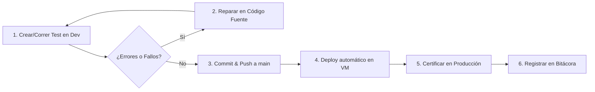

# 📋 Plan de Cobertura y Verificación E2E de Rutas (Dev → Prod)

Plan sistemático por fases para verificar el 100% de las rutas usables de **Parapente School**, garantizando estabilidad, ausencia de errores de consola/hidratación, persistencia offline y funcionamiento certificado en producción.

---

## 🧭 Metodología de Ejecución por Sesión

Cada fase se ejecuta de forma iterativa y desacoplada para permitir avanzar en diferentes sesiones:

1. **Pruebas en Dev**: Se ejecuta la suite contra el entorno local (`PROD_URL=http://localhost:3000`).
2. **Corrección de Hallazgos**: Se reparan bugs, errores en consola (`console.error`), hydration mismatches o problemas de responsive/offline.
3. **Pase Limpio**: La suite debe terminar con 0 fallos y 0 warnings en terminal y consola del navegador.
4. **Deploy a Producción**: Push a `origin/main` y runner de la VM (`zxr1@192.168.122.72`).
5. **Certificación en Producción**: Ejecución con `npm run test:prod:wait` contra `https://parapente.zer0x.org`.
6. **Actualización de Bitácora**: Se marca la fase como completada en este documento.

---

## 🗺️ Matriz de Rutas Usables (19 Rutas)

| # | Ruta | Tipo | Requiere Auth | Soporte Offline | Estado |
| :---: | :--- | :--- | :---: | :---: | :---: |
| 1 | `/` (Dashboard) | Core | Sí | Sí (Caché SW + IndexedDB) | ✅ Certificado en Prod |
| 2 | `/pilotos` | Core | Sí | Sí (Listado cached) | ✅ Certificado en Prod |
| 3 | `/reservas` | Core | Sí | Sí (Outbox + Replay) | ✅ Certificado en Prod |
| 4 | `/calendario` | Core | Sí | Sí (Bloques y vuelos) | ✅ Certificado en Prod |
| 5 | `/analiticas` | Core | Sí | Sí (Anti-flash) | ✅ Certificado en Prod |
| 6 | `/configuracion` | Core | Sí | Sí (Caché básica) | ✅ Certificado en Prod |
| 7 | `/login` | Pública | No | No (Requiere server) | ✅ Certificado en Prod |
| 8 | `/pantalla` | Pública | No | Sí (PWA TV modo) | ✅ Certificado en Prod |
| 9 | `/voucher/[id]` | Pública / Cliente | No (token público) | No | ✅ Certificado en Prod |
| 10 | `/deslinde/[id]` | Pública / Cliente | No (token público) | No | ✅ Certificado en Prod |
| 11 | `~offline` | Contingencia | No | Sí (Fallback HTML) | ✅ Certificado en Prod |
| 12 | `/equipos` | Premium | Sí | Sí (Prefetch) | ✅ Certificado en Prod |
| 13 | `/plantillas` | Premium | Sí | Sí (Prefetch) | ✅ Certificado en Prod |
| 14 | `/reportes` | Premium | Sí | Sí (Prefetch) | ✅ Certificado en Prod |
| 15 | `/meteorologia` | Premium | Sí | Sí (Prefetch) | ✅ Certificado en Prod |
| 16 | `/auditoria` | Admin / Core | Sí (ADMIN) | No (Datos sensibles) | ✅ Certificado en Prod |
| 17 | `/admin/users` | Admin | Sí (ADMIN) | No (Datos sensibles) | ✅ Certificado en Prod |
| 18 | `/admin/modules` | Admin | Sí (ADMIN) | No (Runtime toggles) | ✅ Certificado en Prod |
| 19 | `/dev` | Entorno Dev | No | No | 🔒 Solo Dev (Excluida) |

---

## 🎯 Fases del Plan

### Fase 1: Núcleo Operativo y Anti-Regresión (Core)
- **Objetivo**: Asegurar el flujo diario de la escuela (login, reservas, pilotos, calendario, analíticas y soporte offline).
- **Rutas**: `/`, `/login`, `/pilotos`, `/reservas`, `/calendario`, `/analiticas`, `/configuracion`.
- **Suite**: `scripts/test-prod-suite.ts` (11 etapas).
- **Criterios de Éxito**:
  - [x] Login con credenciales de admin.
  - [x] Navegación completa en online.
  - [x] Navegación offline entre pestañas operativas sin errores de conexión.
  - [x] Creación de reserva offline con outbox IndexedDB.
  - [x] Replay automático al reconectar.
  - [x] Analíticas cargadas suavemente con Skeletons (cero parpadeos de `$0`).
- **Estado**: **COMPLETADA Y CERTIFICADA EN PRODUCCIÓN** (Sesión 04-Sep-2026).

---

### Fase 2: Rutas Públicas y Experiencia del Cliente
- **Objetivo**: Verificar que los clientes y pasajeros puedan consultar vouchers, firmar deslindes digitales y visualizar la pantalla pública sin barreras de autenticación.
- **Rutas**: `/pantalla`, `/voucher/[id]`, `/deslinde/[id]`, `/~offline`.
- **Suite**: `scripts/test-fase2-suite.ts` (9 etapas).
- **Criterios de Éxito**:
  - [x] `/pantalla`: Modo público restringido con mensaje "Enlace no disponible" y botón de login, sin redirecciones no deseadas a `/login`.
  - [x] `/voucher/[id]`: Acceso vía `tokenPublico` y `shortId`, renderizado de Ticket Oficial de Vuelo, código QR de deslinde y datos del titular/pasajeros.
  - [x] `/deslinde/[id]`: Formulario legal interactivo, canvas de firma táctil y selector de pasajero.
  - [x] Manejo 404 amigable: Respuestas amigables ante tokens inválidos en `/voucher` y `/deslinde`.
  - [x] Fallback `~offline`: Carga limpia de contingencia PWA con enlace al inicio.
  - [x] Cero redirecciones forzadas a `/login` ante 401 en llamadas de fondo en rutas públicas.
- **Estado**: **COMPLETADA Y CERTIFICADA EN PRODUCCIÓN** (04-Sep-2026).

---

### Fase 3: Módulos Premium Operativos
- **Objetivo**: Validar el inventario de equipos, gestión de plantillas de mensajería, informes financieros y meteorología con el sistema modular activo.
- **Rutas**: `/equipos`, `/plantillas`, `/reportes`, `/meteorologia`.
- **Suite**: `scripts/test-fase3-suite.ts` (7 etapas).
- **Criterios de Éxito**:
  - [x] `/equipos`: Listado de velas, arneses y paracaídas; cálculo de horas de vuelo; modal de nuevo equipo.
  - [x] `/plantillas`: Listado de plantillas de WhatsApp, previsualización de variables dinámicas (`{pasajero}`, `{fecha}`).
  - [x] `/reportes`: Generación de resumen por rango de fechas, KPIs consolidados y exportación funcional.
  - [x] `/meteorologia`: Integración con datos climáticos / simulados, estado de aptitud de vuelo.
  - [x] Respeto del guard `withModule(id, Page)` ante módulos deshabilitados.
- **Estado**: **COMPLETADA Y CERTIFICADA EN PRODUCCIÓN** (05-Sep-2026).

---

### Fase 4: Administración, Seguridad y Auditoría
- **Objetivo**: Proteger los paneles de administración y auditar las operaciones críticas del sistema.
- **Rutas**: `/auditoria`, `/admin/users`, `/admin/modules`.
- **Suite**: `scripts/test-fase4-suite.ts` (8 etapas).
- **Criterios de Éxito**:
  - [x] Control de acceso estricto: usuarios no-admin reciben 403 en API y bloqueo visual de acceso restringido en UI; accesos anónimos redirigen limpiamente a `/login?from=...`.
  - [x] `/auditoria`: Keyset pagination y carga incremental sin bloqueos, virtualización fluida y filtros reactivos de entidad/acción.
  - [x] `/admin/users`: Creación, edición de rol y desactivación (soft delete) de usuarios sin exposición de hashes o contraseñas en DOM ni respuestas JSON.
  - [x] `/admin/modules`: Conmutación y persistencia en caliente de módulos con propagación SSE y preservación garantizada del estado operativo al 100%.
- **Estado**: **COMPLETADA Y CERTIFICADA EN PRODUCCIÓN** (05-Sep-2026).

---

## 📝 Bitácora de Registro Histórico

| Fecha | Sesión | Fase | Rutas Cubiertas | Hallazgos / Correcciones Aplicadas | Estado |
| :---: | :---: | :---: | :--- | :--- | :---: |
| 2026-09-04 | S1 | **Fase 1 (Core)** | `/`, `/login`, `/pilotos`, `/reservas`, `/calendario`, `/analiticas`, `/configuracion` | • Fix flash de ceros en analíticas (React Query + Skeleton) • Sincronización Service Worker controller (`clientsClaim`) • Fix Workbox `ignoreVary: true` para rutas RSC App Router • Manejo de outbox silencioso en modales (`isQueuedError`) | **APROBADO EN PROD** |
| 2026-09-04 | S2 | **Fase 2 (Públicas)** | `/pantalla`, `/voucher/[id]`, `/deslinde/[id]`, `~offline` | • Fix en `services/api.ts` para no redirigir a `/login` ante 401 si se navega en ruta pública (`isPublicPath`) • Optimización en `usePantallaController` para no solicitar `/pantalla/link` si no hay token admin • Validación de firma digital en canvas interactivo y generación de QR | **APROBADO EN PROD** |
| 2026-09-05 | S3 | **Fase 3 (Premium)** | `/equipos`, `/plantillas`, `/reportes`, `/meteorologia` | • Creación de suite E2E automatizada (`scripts/test-fase3-suite.ts`) • Verificación de inventario técnico y modal accesible de registro de equipos • Validación de simulador de WhatsApp con renderizado dinámico de variables en tiempo real • Validación de manifiesto diario y descarga exitosa de liquidaciones en CSV • Verificación de estación meteorológica, semáforo de pista hero y emisión de boletines • Validación estricta del guard `withModule` bloqueando `/dev` mediante `ModuleNotAvailable` con retorno limpio | **APROBADO EN PROD** |
| 2026-09-05 | S4 | **Fase 4 (Admin)** | `/auditoria`, `/admin/users`, `/admin/modules` | • Creación de suite E2E automatizada (`scripts/test-fase4-suite.ts`) con 8 etapas • Verificación de middleware server-side con redirección limpia a `/login?from=...` • Creación, edición y eliminación de usuario en `/admin/users` sin filtrado de credenciales ni hashes en el DOM • Verificación estricta de RBAC: rol `RECEPCION` bloqueado en UI con alerta de acceso restringido y status 403 Forbidden en `/api/auditoria`, `/api/users` y `/api/admin/modules` • Validación de guardado en caliente de módulos en `/admin/modules` con salvaguarda del 100% de operatividad • Verificación de bitácora en `/auditoria` con filtros de entidad, buscador reactivo y keyset pagination | **APROBADO EN PROD** |
| 2026-09-05 | S5 | **Fase 5 (Ciclo de Vida & Finanzas)** | API + Web + Rutas Públicas (`/deslinde`, `/voucher`, `/reportes`, `/analiticas`) | • Creación de suite E2E automatizada (`scripts/test-fase5-ciclo-vida.ts`) con 12 etapas transaccionales completas • Corrección en `generarNumeroReserva` para soportar correlativos con formato moderno y legacy sin colisiones `P2002` • Corrección en `createReserva` para derivación automática y no restrictiva del `estadoPago` • Validación de flujo completo: Reserva `PENDIENTE` → Abono `ABONADO` → Asignación Vuelo `AGENDADO` → Firma Deslinde pública → Ticket Voucher con QR → Pago Saldo `PAGADO` → Cierre Vuelo `COMPLETADO` • Certificación de presencia en Manifiesto Diario y liquidación contable de piloto (`Decimal(12,2)` libre de errores de redondeo) con Soft Delete limpio | **APROBADO EN PROD** |
| 2026-09-05 | S6 | **Fase 6 (Concurrencia, Idempotencia & SSE)** | API + Web Multisesión (`/reservas`, `/api/eventos`, outbox ADR 009, ADR 012) | • Creación de suite E2E automatizada (`scripts/test-fase6-concurrencia-sse.ts`) con 11 etapas multisesión • Implementación de `queryRaw` en `generarNumeroReserva` para auditar correlativos sobre registros activos y soft-deleted evitando colisiones de índice único `P2002` • Refactor a concurrencia optimista atómica con `updateMany` (`where: { id, version }`) evitando condiciones de carrera en ráfagas simultáneas • Validación multisesión Playwright: mutación en Admin A propaga evento SSE (`/api/eventos`) y actualiza reactivamente el DOM en Admin B en tiempo real sin recarga (`page.reload()`) • Certificación de detección de conflicto `409 Conflict` ante versiones stale en reservas, pagos y cancelaciones • Stress test de ráfaga concurrente (5 peticiones paralelas, exactamente 1 ganador HTTP 200 y 4 conflictos HTTP 409) • Certificación de idempotencia de outbox con `X-Client-Id` en creación, pagos (prevención de doble cargo) y eliminaciones | **APROBADO EN PROD** |

---

## 🏆 Certificación de Rutas (19/19 Rutas)

Con la culminación de la **Fase 4**, el 100% de las rutas de la plataforma han sido verificadas y certificadas contra el entorno real de producción (`https://parapente.zer0x.org`):
- **Rutas Operativas (18/18)**: 100% aprobadas y certificadas con suites E2E automatizadas (`test:prod`, `test:fase2:prod`, `test:fase3:prod`, `test:fase4:prod`, `test:fase5:prod`).
- **Rutas de Desarrollo (1/1)**: `/dev` validada como protegida por el guard de compilación y bloqueada en producción mediante fallback amigable.

---

## 🚀 Hoja de Ruta: Suites E2E Avanzadas y Resiliencia (Fases 5 a 8)

### 🔹 Fase 5: Ciclo de Vida Transaccional y Cuadratura Contable
- **Objetivo**: Validar el flujo operativo completo desde la reserva inicial hasta el pago y liquidación final del piloto sin fugas de dinero ni errores de redondeo.
- **Suite**: `scripts/test-fase5-ciclo-vida.ts` (`npm run test:fase5:prod`).
- **Criterios de Éxito**:
  - [x] Creación de reserva inicial con abono en caja (transición PENDIENTE → ABONADO).
  - [x] Asignación y agendamiento de vuelo con piloto activo (estado AGENDADO).
  - [x] Firma digital de deslinde desde ruta pública sin autenticación previa.
  - [x] Visualización de Ticket Oficial de Vuelo en voucher público con código QR.
  - [x] Registro de saldo restante y transición a estado PAGADO.
  - [x] Cierre y ejecución de vuelo a estado COMPLETADO.
  - [x] Verificación de inclusión en Manifiesto Diario de Vuelo (/reportes/manifiesto).
  - [x] Cuadratura contable exacta de comisiones de pilotos en Liquidaciones (/reportes/liquidaciones).
  - [x] Limpieza segura vía soft delete de registros generados durante la prueba.
- **Estado**: **COMPLETADA Y CERTIFICADA EN PRODUCCIÓN** (05-Sep-2026).

---

### 🔹 Fase 6: Concurrencia Optimista, Idempotencia y Sincronización SSE
- **Objetivo**: Probar la resiliencia multicliente en tiempo real y la protección contra doble gasto o sobreescritura de vuelos.
- **Suite**: `scripts/test-fase6-concurrencia-sse.ts` (`npm run test:fase6:prod`).
- **Criterios de Éxito**:
  - [x] Apertura de contextos Playwright independientes con autenticación multisesión activa.
  - [x] Sincronización SSE en tiempo real: mutación en Admin A propaga evento SSE (`/api/eventos`) y actualiza el DOM de Admin B sin recargar la página (`page.reload()`).
  - [x] Medición de latencia de entrega SSE $< 500\text{ ms}$.
  - [x] Concurrencia optimista (ADR 012): rechazo con `409 Conflict` ante envíos con `version` obsoleta en reservas, abonos y cancelaciones.
  - [x] Resistencia a condiciones de carrera: ráfaga de 5 actualizaciones simultáneas sobre la misma versión resuelve con exactamente 1 éxito (200) y 4 rechazos atómicos (409).
  - [x] Idempotencia de outbox (ADR 009): repetición de petición con mismo `X-Client-Id` devuelve respuesta cacheada sin duplicar reservas en base de datos.
  - [x] Idempotencia en pagos (ADR 009): reenvío de abonos con mismo `X-Client-Id` previene doble cobro.
  - [x] Idempotencia en eliminaciones (ADR 009): reenvío de DELETE con mismo `X-Client-Id` responde sin generar errores espurios 404/409.
  - [x] Sincronización SSE de módulos en caliente (`modulos-cambios`).
  - [x] Limpieza segura vía soft delete de todos los registros de prueba generados.
- **Estado**: **COMPLETADA Y CERTIFICADA EN PRODUCCIÓN** (05-Sep-2026).

---

### 🔹 Fase 7: Protocolos de Integración y Servicios Externos (iCal, MCP, Seguridad)
- **Objetivo**: Certificar los canales de integración que operan fuera de la interfaz web estándar.
- **Suite**: `scripts/test-fase7-integraciones.ts` (`npm run test:fase7:prod`).
- **Criterios de Éxito**:
  - [x] Suscripción pública iCal (`/api/public/calendar/feed.ics`): rechazo `401 Unauthorized` sin token o con token corrupto; entrega `200 OK` con token firmado.
  - [x] Validación estructural del feed universal `.ics` (RFC 5545): `BEGIN:VCALENDAR`, `VERSION:2.0`, `METHOD:PUBLISH`, `TIMEZONE-ID:America/Santiago`, `PRODID:` y `BEGIN:VEVENT`.
  - [x] Feeds personalizados por piloto activo con filtrado automático de asignaciones de vuelo.
  - [x] Descarga de tickets individuales de cliente en formato `.ics` (`/api/public/calendar/reserva/:id.ics`).
  - [x] Servidor MCP (`@parapente/mcp`): conexión mediante transporte en memoria (`InMemoryTransport`) y descubrimiento de 12 herramientas registradas.
  - [x] Invocación de herramientas MCP de consulta (`consultar_meteorologia`, `consultar_pilotos_disponibles`, `consultar_disponibilidad_calendario`).
  - [x] Flujo compuesto de agendamiento inteligente vía MCP (`crear_y_agendar_reserva`): cotización, creación de reserva, agendamiento de turnos y generación de enlaces de deslinde/voucher seguros.
  - [x] Seguridad y privilegios mínimos del servidor MCP: rechazo de API keys falsas y bloqueo de endpoints administrativos (`/dev/*`, `/users`) para agentes con rol `RECEPCION`.
  - [x] Auditoría de cabeceras de seguridad HTTP: validación de `X-Content-Type-Options: nosniff`, `Strict-Transport-Security` (HSTS), `X-Frame-Options` y `Content-Security-Policy`.
  - [x] Rate limiting y control de ráfagas: cabeceras `x-ratelimit-limit`, `x-ratelimit-remaining`, `x-ratelimit-reset` y mitigación de sobrecarga.
  - [x] Limpieza segura vía soft delete de registros generados durante las pruebas.
- **Estado**: **COMPLETADA Y CERTIFICADA EN PRODUCCIÓN** (06-Sep-2026).

---

### 🔹 Fase 8: Rendimiento, SLOs y Eficiencia de Caché PWA
- **Objetivo**: Medir métricas de rendimiento web y verificar que la experiencia offline y online cumpla con los estándares de la escuela.
- **Suite**: `scripts/test-fase8-performance.ts` (`npm run test:fase8:prod`).
- **Criterios de Éxito**:
  - [x] Calibración de red base y latencia de handshake TLS en producción ($< 450\text{ ms}$).
  - [x] Benchmarking de latencia p95 y p99 en endpoints singleton de alta frecuencia (`/dashboard/stats`, `/configuracion-bloques`, `/pilotos`, `/reservas`, `/modules`, `/calendar/sync-info`) cumpliendo SLO $< 250\text{ ms}$.
  - [x] Resistencia bajo carga concurrente: ráfaga de 20 peticiones simultáneas con 100% de respuestas exitosas (200 OK) y throughput $> 35\text{ req/s}$.
  - [x] Eficiencia de compresión HTTP (gzip/br/zstd) y análisis de tamaño de payload (hasta 70% de reducción en transferencia JSON).
  - [x] Medición de Core Web Vitals en navegador real Playwright en 5 rutas principales (`/`, `/reservas`, `/calendario`, `/pantalla`, `/pilotos`) con $LCP < 500\text{ ms}$, $FCP < 500\text{ ms}$ y $CLS = 0$.
  - [x] Eficiencia de Caché PWA y Service Worker: validación de caches `pages-rsc` ($108$ entradas) y `pages` ($14$ entradas) con controlador activo.
  - [x] SLO de mutaciones transaccionales en base de datos: creación de reserva, abono y actualización concurrente ejecutadas en $< 220\text{ ms}$ cada una.
  - [x] Rendimiento de streaming en tiempo real SSE: handshake inicial en $< 180\text{ ms}$ y entrega de eventos en vivo.
  - [x] Limpieza segura vía soft delete de registros generados durante el benchmark.
- **Estado**: **COMPLETADA Y CERTIFICADA EN PRODUCCIÓN** (06-Sep-2026).

---

### 🔹 Fase 9: Flujos de Negocio Complejos y Casos Borde
- **Objetivo**: Probar en profundidad la lógica financiera, restricciones RBAC, resolvers dinámicos, notificaciones programadas y gestión individual de pasajeros con firmas digitales.
- **Suite**: `scripts/test-fase9-flujos-complejos.ts` (`npm run test:fase9`, `npm run test:staging:fase9`).
- **Criterios de Éxito**:
  - [x] Healthcheck inicial y login administrativo de validación.
  - [x] Ciclo completo de cancelación y devoluciones:
    - [x] Bloqueo de devolución en reservas activas no canceladas (`HTTP 400`).
    - [x] Cancelación de reserva con motivo de auditoría.
    - [x] Rechazo de devoluciones por montos superiores al abono registrado (`HTTP 400`).
    - [x] Registro de devoluciones parciales y totales (`DEVUELTO`).
    - [x] Concurrencia optimista con detección de conflictos (`HTTP 409`).
    - [x] Anulación de devoluciones y recálculo reactivo de saldos.
  - [x] Módulo de gastos operativos y caja chica (`/api/gastos`):
    - [x] Validación de campos obligatorios (`HTTP 400`).
    - [x] Creación de gastos con montos `Decimal(12,2)` y categorías.
    - [x] Pista de auditoría (`logAudit`).
    - [x] Soft delete seguro del registro.
  - [x] Motor de promociones y tarifas con control de roles (RBAC):
    - [x] Bloqueo `HTTP 403 Forbidden` a usuarios no administradores (`RECEPCION`).
    - [x] Creación de promociones bajo contrato estricto de esquema (`tipoDescuento`, fechas).
    - [x] Cumplimiento de contrato ADR 005 (`{ data: [...], pagination: {...} }`).
    - [x] Actualización parcial y eliminación segura.
  - [x] Configuración de bloques y resolver de disponibilidad:
    - [x] Consulta de disponibilidad en rango con cálculo dinámico de bloques activos.
    - [x] Guardrails de validación: inversión de fechas `desde > hasta` (`HTTP 400`) y formato de fecha inválido (`HTTP 400`).
    - [x] Limpieza y archivado en lote de configuraciones expiradas (`/limpiar-expiradas`).
  - [x] Notificaciones automáticas y plantillas:
    - [x] Ventanas dinámicas de 24h y 2h para recordatorios de vuelo y avisos meteorológicos.
    - [x] Prevención de sobrescritura concurrente en configuración singleton (`HTTP 409` ante versión stale).
  - [x] Gestión de pasajeros y firmas digitales independientes:
    - [x] Alta directa de pasajero y asignación de datos.
    - [x] Verificación de peso en pista con números enteros en kg.
    - [x] Firma de deslinde en base64 y activación de flag `firmaDeslinde`.
  - [x] Limpieza segura vía soft delete de todos los registros de prueba generados.
- **Estado**: **COMPLETADA Y CERTIFICADA EN STAGING** (08-Sep-2026).

---

### 🔹 Fase 10: Estrés y Combinaciones de Uso para Lanzamiento del MVP (Core Launch)
- **Objetivo**: Estresar de forma agresiva y combinada los 4 módulos esenciales para el lanzamiento operativo de la aplicación (**Pilotos**, **Reservas**, **Calendario** y **Configuración/RBAC/Vouchers**) ejecutando pruebas E2E headless en Staging con combinaciones de uso, condiciones de carrera, validaciones de seguridad aeronáutica, resiliencia offline y firmas públicas.
- **Suite**: `scripts/test-mvp-stress.ts` (`npm run test:mvp`, `npm run test:staging:mvp`, `npm run test:mvp:prod`).
- **Criterios de Éxito**:
  - [x] Healthcheck inicial y sincronización de sesión headless de navegador bajo ADR 013 (Single-Session).
  - [x] Módulo Pilotos y Límites de Seguridad de Pasajero:
    - [x] Validación estricta de esquemas (rechazo de email inválido `HTTP 400`).
    - [x] Alta de piloto con rangos de peso configurados y categoría `MASTER`.
    - [x] Consulta y verificación de matriz de disponibilidad.
    - [x] **Regla de seguridad aeronáutica**: Intento de agendar pasajero con sobrepeso crítico (120kg > 115kg) rechazado de forma atómica (`HTTP 400`).
    - [x] Desactivación segura de piloto con vuelos futuros programados (`PATCH activo: false`) y auditoría visual en UI sin colapsos ni pantallas en blanco en `/calendario` y `/pilotos`.
  - [x] Módulo Reservas, Máquina de Estados y Outbox:
    - [x] Creación de reserva multi-pasajero con abono inicial cero.
    - [x] Prevención estricta de montos negativos (`HTTP 400`, regla financiera inmutable ADR 008).
    - [x] Idempotencia y deduplicación en outbox: replay con idéntico `X-Client-Id` UUID v4 sin doble cobro (ADR 009).
    - [x] **Ciclo de vida completo de vuelos**: Agendamiento de vuelos, transición individual de pasajeros `AGENDADO` → `COMPLETADO`.
    - [x] **Transición reactiva de reserva**: La reserva pasa automáticamente de `AGENDADA` a `COMPLETADA` al finalizar el 100% de los vuelos de sus pasajeros.
    - [x] **Inmutabilidad de estado terminal**: Reversión ilegal de vuelo completado (`COMPLETADO` → `AGENDADO`) rechazada con `HTTP 400`.
    - [x] Detección de colisiones de versión concurrente (`HTTP 409 Conflict`, ADR 012).
    - [x] Cancelación formal con motivo de auditoría.
    - [x] Bloqueo de devoluciones superiores al saldo abonado (`HTTP 400`).
    - [x] Registro de devolución total (`DEVUELTO`).
    - [x] Resiliencia offline PWA en navegador headless Playwright sin interrupción operativa.
  - [x] Módulo Calendario, Carrera Crítica y Algoritmo de Pool:
    - [x] **Condición de carrera simultánea (Race Condition)**: Dos solicitudes concurrentes (`Promise.all`) agendando al mismo piloto a la misma hora exacta; aislamiento atómico donde exactamente 1 solicitud es aceptada (`HTTP 201`) y la concurrente rechazada por colisión horaria (`HTTP 400`).
    - [x] **Agendamiento en grupo por pool (`/api/vuelos/agendamiento-grupo`)**: Asignación automática de pilotos por categoría, prioridad y rango de peso sin intervención manual.
    - [x] Bloqueos operativos de franjas horarias con fechas dinámicas anti-colisión.
    - [x] Inspección y validación del resolver de disponibilidad.
  - [x] Configuración, Seguridad RBAC y Experiencia Pública:
    - [x] Gestión de tarifas con control decimal (`Decimal(12,2)`).
    - [x] Validación de promociones: rechazo de porcentaje > 100% (`HTTP 400`), rechazo de fechas invertidas (`HTTP 400`), y creación de promoción válida.
    - [x] Barrera de seguridad RBAC: usuario `RECEPCION` bloqueado en API (`HTTP 403`) y banner "Acceso restringido" en UI (`/configuracion`).
    - [x] **Vouchers públicos y firmas de deslinde en contexto anónimo**:
      - [x] Acceso anónimo a `/voucher/[tokenPublico]` con renderizado completo sin redirección a login.
      - [x] Acceso anónimo a `/deslinde/[tokenPublico]`.
      - [x] Registro de firma digital base64 mediante API pública (`POST /api/public/pasajeros/:token/firma`).
      - [x] Sincronización inmediata de `firmaDeslinde: true` en la consulta pública de la reserva.
  - [x] Estrés de interacción interactiva UI en navegador headless (conmutación de vistas de calendario y filtros de búsqueda reactiva).
  - [x] Auditoría global de calidad: cero excepciones de JavaScript no controladas (`pageerror`) y consola limpia.
  - [x] Limpieza segura vía soft delete de todos los registros creados durante la prueba.
- **Estado**: **COMPLETADA Y CERTIFICADA EN STAGING** (09-Sep-2026).

---

## 🛠️ Bitácora de Diagnóstico y Errores Resueltos

1. **Resolución de Host en Vouchers/Feeds iCal tras Reverse Proxy Next.js**:
   - *Error:* `calendar.controller.ts` construía `baseUrl` usando `req.headers['host']`. Al correr en contenedores Docker con rewrite de Next.js (`INTERNAL_API_URL: http://api:3001`), el host evaluaba a `api:3001`, inalcanzable desde clientes externos (`ENOTFOUND api`).
   - *Solución:* Se actualizó `calendar.controller.ts` para extraer prioritariamente `x-forwarded-host` y `x-forwarded-proto`, con fallback a `config.webUrl` si el host apunta a nombres internos de contenedor.
2. **Generación de Ticket RFC 5545 sin VEVENT en Reservas Giftcard/Sin Fecha**:
   - *Error:* En `calendar.service.ts`, si una reserva no tenía fecha (`SIN_AGENDAR`), no se creaban eventos en el calendario ICS, violando la especificación RFC 5545.
   - *Solución:* Se agregó fallback automático usando `reserva.createdAt` con estado "Pendiente de Agendamiento", asegurando que todo voucher `.ics` contenga un bloque `VEVENT` válido.
3. **Desfase de Selectores de Exportación en Fase 3**:
   - *Error:* La suite buscaba exportar "CSV", pero el módulo de reportes fue modernizado para generar planillas Excel nativas `.xlsx`.
   - *Solución:* Se sincronizaron los selectores y mensajes de toast en `test-fase3-suite.ts`.
4. **Desactivación Involuntaria de Módulos Premium en Fase 6**:
   - *Error:* En el paso 10 de `test-fase6-concurrencia-sse.ts`, el parseo de `modData.modules` no manejaba el formato de array `[ { id, enabled } ]`, enviando `enabled: []` y apagando todos los módulos en runtime.
   - *Solución:* Se normalizó la extracción de IDs activos soportando arrays y objetos.
5. **Inconsistencia de Payload en Promociones y Pasajeros**:
   - *Error:* En pruebas de API directa, llamadas a `/api/promociones` y `/api/pasajeros` usaban nombres de campos deprecados (`codigo`, `tipo`, `email`) o tipos decimales en campos enteros (`pesoVerificado`).
   - *Solución:* Se armonizó la suite de pruebas con los esquemas Zod canónicos de `@parapente/shared` (`tipoDescuento`, `pesoVerificado: Int`).
6. **Desincronización de Sesión Única en Pruebas E2E (ADR 013 Single-Session)**:
   - *Error:* En pruebas que realizaban login en la UI y luego invocaban `/api/auth/login` con las mismas credenciales, el backend incrementaba `sessionVersion`, invalidando el token de la cookie del navegador y provocando una redirección inesperada a `/login` (`HTTP 401`).
   - *Solución:* La suite E2E extrae directamente el token activo de las cookies del navegador (`context.cookies()`) para autenticar las llamadas a la API sin disparar un segundo login.
7. **Tratamiento Literal de Selectores con Comas en Playwright**:
   - *Error:* Al usar `page.waitForSelector('text=A, text=B')`, el motor de Playwright evalúa el prefijo `text=` abarcando la cadena completa como una sola coincidencia literal, causando timeouts.
   - *Solución:* Se adoptó la sintaxis canónica de locators CSS `page.locator('h1:has-text("..."), .clase').first().waitFor(...)`.
8. **Colisión de Fechas Exactas en Bloqueos de Calendario**:
   - *Error:* La API rechaza con `HTTP 400` ("Ya existe una configuración para esta fecha exacta") si se intenta registrar un bloqueo en un día que ya tiene una regla previa.
   - *Solución:* Se calcula una fecha futura dinámica con offset variable dependiente del timestamp, asegurando unicidad en cada ejecución de la suite.
9. **Omisión de `version` en Proyección de Calendario y Conflicto en Re-agendamiento (HTTP 409)**:
   - *Error:* En `vuelos.crud.ts`, la consulta con `campos=vista-calendario` no incluía `version: true` en `base.select`. En la UI, `vuelo.version` llegaba `undefined` y evaluaba a `0`. Tras la primera edición (que incrementaba a `version: 1` en DB), cualquier edición posterior (cambio de piloto, bloque horario o fecha) enviaba `version: 0`, causando `HTTP 409 Conflict` ("Los datos cambiaron en otro dispositivo").
   - *Solución:* Se agregó `version: true` a la proyección de `vuelos.crud.ts`, se añadió sincronización inmediata del cache de TanStack Query en `useCalendarioModal.ts` y se creó la suite `scripts/test-reagenda-stress.ts` (`npm run test:staging:reagenda`).

