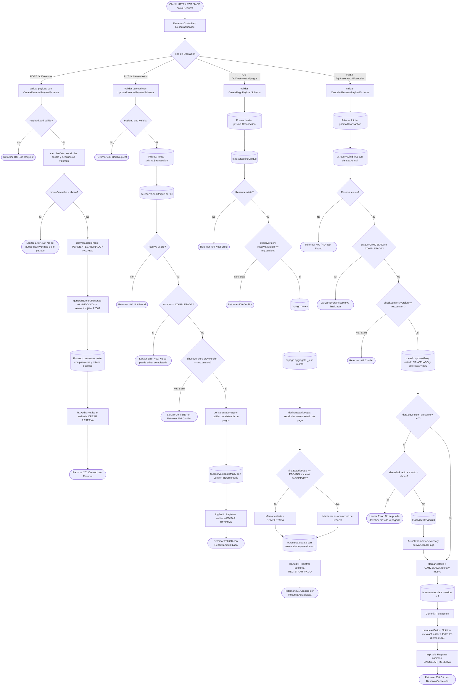

# Diagrama de Flujo: Módulo de Reservas, Pagos y Ciclo de Vida

Este documento detalla el flujo de ejecución técnica del ciclo de vida de una reserva en **Parapente School**, abarcando la creación con cálculo de tarifas, actualización con control de concurrencia optimista (ADR 004), registro de pagos/abonos, derivación automática de estados y cancelación con devolución.

---

## 1. Diagrama de Flujo Técnico (`flowchart TD`)

---

## 2. Matriz de Referencia Cruzada: [Paso del Diagrama] -> [Código Fuente]

| Paso del Diagrama | Archivo / Ubicación | Función o Componente | Líneas de Código |
| :--- | :--- | :--- | :--- |
| **Punto de Entrada Controller** | `apps/api/src/controllers/reservas.controller.ts` | `ReservasController` | [`L7-L33`](file:///home/zer0x/projects/paraglide/apps/api/src/controllers/reservas.controller.ts#L7-L33) |
| **Validación Zod Create** | `apps/api/src/controllers/reservas.controller.ts` | `create(req, reply)` | [`L22-L23`](file:///home/zer0x/projects/paraglide/apps/api/src/controllers/reservas.controller.ts#L22-L23) |
| **Cálculo de Tarifas & Invariantes** | `apps/api/src/services/reservas/reservas.crud.ts` | `createReserva(data)` | [`L44-L71`](file:///home/zer0x/projects/paraglide/apps/api/src/services/reservas/reservas.crud.ts#L44-L71) |
| **Generación Correlativo AAMMDD-XX** | `apps/api/src/services/reservas/reservas.crud.ts` | `generarNumeroReserva()` | [`L14-L42`](file:///home/zer0x/projects/paraglide/apps/api/src/services/reservas/reservas.crud.ts#L14-L42) |
| **Inserción de Reserva y Pasajeros** | `apps/api/src/services/reservas/reservas.crud.ts` | `prisma.reserva.create` | [`L92-L135`](file:///home/zer0x/projects/paraglide/apps/api/src/services/reservas/reservas.crud.ts#L92-L135) |
| **Guard de Concurrencia Optimista** | `apps/api/src/services/concurrencia.service.ts` | `checkVersion(actual, esperada)` | [`L4-L12`](file:///home/zer0x/projects/paraglide/apps/api/src/services/concurrencia.service.ts#L4-L12) |
| **Edición Atómica con Versionado** | `apps/api/src/services/reservas/reservas.crud.ts` | `updateReserva(id, data)` | [`L139-L200`](file:///home/zer0x/projects/paraglide/apps/api/src/services/reservas/reservas.crud.ts#L139-L200) |
| **Manejo de Errores 409 / 400 / 404** | `apps/api/src/controllers/reservas.controller.ts` | `update(req, reply)` | [`L47-L61`](file:///home/zer0x/projects/paraglide/apps/api/src/controllers/reservas.controller.ts#L47-L61) |
| **Registro de Pagos y Recálculo** | `apps/api/src/services/reservas/reservas.pagos.ts` | `addPagoReserva(reservaId, data)` | [`L11-L74`](file:///home/zer0x/projects/paraglide/apps/api/src/services/reservas/reservas.pagos.ts#L11-L74) |
| **Derivación Automática Estado Pago** | `packages/shared/src/schemas/reservas.ts` | `derivarEstadoPago(total, abono, dev)` | Shared utility |
| **Cancelación y Soft-delete Vuelos** | `apps/api/src/services/reservas/reservas.ciclo-vida.ts` | `cancelarReserva(id, data)` | [`L84-L110`](file:///home/zer0x/projects/paraglide/apps/api/src/services/reservas/reservas.ciclo-vida.ts#L84-L110) |
| **Devolución Atómica Integrada** | `apps/api/src/services/reservas/reservas.ciclo-vida.ts` | `cancelarReserva: data.devolucion` | [`L111-L157`](file:///home/zer0x/projects/paraglide/apps/api/src/services/reservas/reservas.ciclo-vida.ts#L111-L157) |
| **Broadcast SSE Fuera de Transacción** | `apps/api/src/services/reservas/reservas.ciclo-vida.ts` | `broadcastDatos('vuelo', 'actualizar')` | [`L159-L163`](file:///home/zer0x/projects/paraglide/apps/api/src/services/reservas/reservas.ciclo-vida.ts#L159-L163) |
| **Auditoría Transversal Inmutable** | `apps/api/src/services/auditoria.service.ts` | `logAudit(req, params)` | Invocado en cada mutación |
