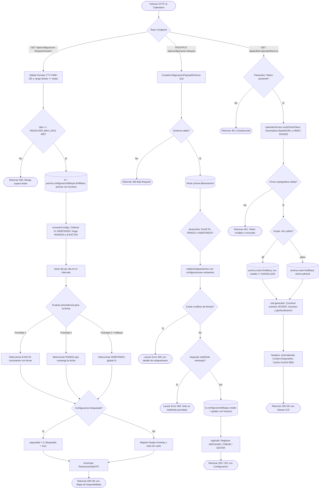

# Diagrama de Flujo: Módulo de Calendario, Slots y Capacidad

Este documento describe la arquitectura técnica del subsistema de **Calendario, Franjas Horarias y Capacidad Dinámica** en **Parapente School**, incluyendo la jerarquía de resolución de configuraciones de bloques, el cálculo de disponibilidad horaria, la prevención de solapamientos y la generación de feeds iCalendar (`.ics`) con verificación criptográfica HMAC-SHA256.

---

## 1. Diagrama de Flujo Técnico (`flowchart TD`)

---

## 2. Matriz de Referencia Cruzada: [Paso del Diagrama] -> [Código Fuente]

| Paso del Diagrama | Archivo / Ubicación | Función o Componente | Líneas de Código |
| :--- | :--- | :--- | :--- |
| **Punto de Entrada Resolver** | `apps/api/src/routes/configuracionBloques.ts` | `fastify.get('/resolver')` | [`L33-L60`](file:///home/zer0x/projects/paraglide/apps/api/src/routes/configuracionBloques.ts#L33-L60) |
| **Validación de Rango y Límite** | `apps/api/src/routes/configuracionBloques.ts` | `formatoFecha y RESOLVER_MAX_DIAS` | [`L41-L56`](file:///home/zer0x/projects/paraglide/apps/api/src/routes/configuracionBloques.ts#L41-L56) |
| **Jerarquía de Precedencia** | `packages/shared/src/utils/configuracion.ts` | `resolverConfiguracion(configs, dia)` | Shared core logic |
| **Numeración Determinista** | `packages/shared/src/utils/configuracion.ts` | `numerarConfigs(configs)` | Shared core logic |
| **Validación de Solapamientos** | `apps/api/src/services/configuracion.service.ts` | `validarSolapamientos(db, data)` | [`L86-L120`](file:///home/zer0x/projects/paraglide/apps/api/src/services/configuracion.service.ts#L86-L120) |
| **Detección de Solapamiento Temporal**| `apps/api/src/services/configuracion.service.ts` | `solapan(aIni, aFin, bIni, bFin)` | [`L56-L69`](file:///home/zer0x/projects/paraglide/apps/api/src/services/configuracion.service.ts#L56-L69) |
| **Creación Atómica de Configuración** | `apps/api/src/routes/configuracionBloques.ts` | `fastify.post('/')` | [`L106-L140`](file:///home/zer0x/projects/paraglide/apps/api/src/routes/configuracionBloques.ts#L106-L140) |
| **Punto de Entrada Feed iCalendar** | `apps/api/src/controllers/calendar.controller.ts` | `CalendarController.getFeed` | [`L11-L58`](file:///home/zer0x/projects/paraglide/apps/api/src/controllers/calendar.controller.ts#L11-L58) |
| **Generación de Token HMAC-SHA256** | `apps/api/src/services/calendar.service.ts` | `generateFeedToken(scope, pilotoId)` | [`L21-L35`](file:///home/zer0x/projects/paraglide/apps/api/src/services/calendar.service.ts#L21-L35) |
| **Verificación Timing-Safe de Token** | `apps/api/src/services/calendar.service.ts` | `verifyFeedToken(token)` | [`L40-L65`](file:///home/zer0x/projects/paraglide/apps/api/src/services/calendar.service.ts#L40-L65) |
| **Generación Estructurada ICS** | `apps/api/src/services/calendar.service.ts` | `generateFeed(options)` | [`L70-L150`](file:///home/zer0x/projects/paraglide/apps/api/src/services/calendar.service.ts#L70-L150) |
