# Diagrama de Flujo: Módulo de Operaciones de Vuelo y Despacho

Este documento detalla el flujo de ejecución técnica para el agendamiento individual y grupal de vuelos, el emparejamiento automatizado piloto-pasajero por límites de peso, el bloqueo pesimista en base de datos (`SELECT ... FOR UPDATE`), la máquina de estados de vuelo y la compleción automática de reservas en **Parapente School**.

---

## 1. Diagrama de Flujo Técnico (`flowchart TD`)

```mermaid
flowchart TD
    %% Inicio y punto de entrada
    Start([Peticion HTTP Operaciones / Vuelos]) --> Controller[VuelosController]

    %% Router / Operación
    Controller --> ActionVuelo{Tipo de Accion}

    %% RAMA 1: AGENDAMIENTO GRUPAL / DESPACHO
    ActionVuelo -- POST /api/vuelos/agendar-grupo --> ValGrupo[Leer reservaId, fechaHora, version y asignaciones]
    ValGrupo --> FindReserva[(prisma.reserva.findUnique con pasajeros activos)]
    FindReserva --> ExistsReserva{Reserva valida?}
    ExistsReserva -- No --> Err404Res([Retornar 400: Reserva no encontrada])
    ExistsReserva -- Si --> CheckVerRes{checkVersion: reserva.version == req.version?}
    CheckVerRes -- No / Stale --> Err409Res([Retornar 409 Conflict])
    CheckVerRes -- Si --> CheckAsignaciones{Asignaciones provistas en payload?}
    CheckAsignaciones -- No --> AutoAssignCall[autoAssignVuelos: calcular pilotos ordenados por carga y peso maximo]
    CheckAsignaciones -- Si --> ApplyAsignaciones[Usar asignaciones manuales]
    AutoAssignCall --> TxAgendar[(Iniciar prisma.$transaction)]
    ApplyAsignaciones --> TxAgendar
    TxAgendar --> LoopPax[Iterar sobre cada pasajero de la reserva]
    LoopPax --> CheckPilotoDisp{Piloto asignado disponible?}
    CheckPilotoDisp -- No --> ErrNoPiloto([Lanzar Error 400: No hay piloto disponible])
    CheckPilotoDisp -- Si --> CheckPrevVuelo[(tx.vuelo.findFirst previo del pasajero)]
    CheckPrevVuelo --> HasPrevVuelo{Tenia vuelo previo activo?}
    HasPrevVuelo -- Si --> SoftDeletePrev[(tx.vuelo.update: soft-delete y version + 1)]
    HasPrevVuelo -- No --> CreateVueloDB[(tx.vuelo.create: estado AGENDADO, pagoPiloto)]
    SoftDeletePrev --> CreateVueloDB
    CreateVueloDB --> NextPax{Mas pasajeros?}
    NextPax -- Si --> LoopPax
    NextPax -- No --> UpdateReservaAgenda[(tx.reserva.update: estado AGENDADA, fechaAgenda, version + 1)]
    UpdateReservaAgenda --> CommitAgendar[Commit Transaccion Grupal]
    CommitAgendar --> BroadcastAgendar[broadcastDatos: Notificar 'reserva' y 'piloto' por SSE]
    BroadcastAgendar --> AuditAgendar[logAudit: Registrar auditoria ASIGNAR_VUELO]
    AuditAgendar --> OutAgendar([Retornar 201 Created con Vuelos Creados])

    %% RAMA 2: TRANSICIÓN DE ESTADO DE VUELO
    ActionVuelo -- PUT /api/vuelos/:id/estado --> ValEstado[Validar id, nuevo estado y version]
    ValEstado --> TxEstado[(Iniciar prisma.$transaction)]
    TxEstado --> LockRow[(tx.$queryRaw: SELECT id FROM Vuelo WHERE id = id FOR UPDATE)]
    LockRow --> FindVuelo[(tx.vuelo.findFirst activo)]
    FindVuelo --> ExistsVuelo{Vuelo existe?}
    ExistsVuelo -- No --> Err404Vuelo([Retornar 400: Vuelo no encontrado])
    ExistsVuelo -- Si --> CheckVerVuelo{checkVersion: vuelo.version == req.version?}
    CheckVerVuelo -- No / Stale --> Err409Vuelo([Retornar 409 Conflict])
    CheckVerVuelo -- Si --> CheckTransition{puedeTransicionarEstadoVuelo: estadoActual -> nuevoEstado?}
    CheckTransition -- Transicion Invalida --> ErrTrans([Lanzar Error 400: Transicion invalida])
    CheckTransition -- Transicion Valida --> DBUpdateEstado[(tx.vuelo.update: nuevo estado, version + 1)]
    DBUpdateEstado --> CheckCompletado{nuevoEstado == COMPLETADO?}
    CheckCompletado -- No --> CommitEstado[Commit Transaccion]
    CheckCompletado -- Si --> CheckTodosVolados[(Verificar si todos los pasajeros de la reserva volaron)]
    CheckTodosVolados --> AllVolados{Todos con vuelo COMPLETADO y estadoPago PAGADO?}
    AllVolados -- Si --> AutoCompletarReserva[(tx.reserva.update: estado = COMPLETADA, version + 1)]
    AllVolados -- No --> CommitEstado
    AutoCompletarReserva --> CommitEstado
    CommitEstado --> CheckBroadcastReserva{Reserva fue completada?}
    CheckBroadcastReserva -- Si --> BroadcastReservaSSE[broadcastDatos: 'reserva' actualizar]
    CheckBroadcastReserva -- No --> SkipBroadcastReserva[No broadcast adicional]
    BroadcastReservaSSE --> AuditEstado[logAudit: Registrar CAMBIAR_ESTADO]
    SkipBroadcastReserva --> AuditEstado
    AuditEstado --> OutEstado([Retornar 200 OK con Vuelo Actualizado])
```

---

## 2. Matriz de Referencia Cruzada: [Paso del Diagrama] -> [Código Fuente]

| Paso del Diagrama | Archivo / Ubicación | Función o Componente | Líneas de Código |
| :--- | :--- | :--- | :--- |
| **Punto de Entrada Controller** | `apps/api/src/controllers/vuelos.controller.ts` | `VuelosController` | [`L6-L122`](file:///home/zer0x/projects/paraglide/apps/api/src/controllers/vuelos.controller.ts#L6-L122) |
| **Endpoint Agendamiento Grupal** | `apps/api/src/controllers/vuelos.controller.ts` | `agendarGrupo(req, reply)` | [`L71-L85`](file:///home/zer0x/projects/paraglide/apps/api/src/controllers/vuelos.controller.ts#L71-L85) |
| **Algoritmo de Auto-Asignación** | `apps/api/src/services/vuelos/vuelos.matching.ts` | `autoAssignVuelos(fechaHora, paxs)` | Service matching |
| **Ejecución Transaccional Grupal** | `apps/api/src/services/vuelos/vuelos.lifecycle.ts` | `agendarGrupoVuelos(data)` | [`L8-L100`](file:///home/zer0x/projects/paraglide/apps/api/src/services/vuelos/vuelos.lifecycle.ts#L8-L100) |
| **Reemplazo de Vuelos Previos** | `apps/api/src/services/vuelos/vuelos.lifecycle.ts` | `tx.vuelo.update (deletedAt = now)` | [`L55-L60`](file:///home/zer0x/projects/paraglide/apps/api/src/services/vuelos/vuelos.lifecycle.ts#L55-L60) |
| **Endpoint Transición de Estado** | `apps/api/src/controllers/vuelos.controller.ts` | `updateEstado(req, reply)` | [`L87-L109`](file:///home/zer0x/projects/paraglide/apps/api/src/controllers/vuelos.controller.ts#L87-L109) |
| **Bloqueo Pesimista FOR UPDATE** | `apps/api/src/services/vuelos/vuelos.lifecycle.ts` | `tx.$queryRaw: SELECT ... FOR UPDATE` | [`L110-L112`](file:///home/zer0x/projects/paraglide/apps/api/src/services/vuelos/vuelos.lifecycle.ts#L110-L112) |
| **Reglas de Máquina de Estados** | `packages/shared/src/utils/vuelos.ts` | `puedeTransicionarEstadoVuelo()` | Shared state machine |
| **Auto-Completado de Reserva** | `apps/api/src/services/vuelos/vuelos.lifecycle.ts` | `tx.reserva.update (estado: COMPLETADA)` | [`L140-L163`](file:///home/zer0x/projects/paraglide/apps/api/src/services/vuelos/vuelos.lifecycle.ts#L140-L163) |
| **Emisión Reactiva SSE** | `apps/api/src/services/vuelos/vuelos.lifecycle.ts` | `broadcastDatos('reserva' / 'piloto')` | [`L102-L103, L170`](file:///home/zer0x/projects/paraglide/apps/api/src/services/vuelos/vuelos.lifecycle.ts#L102-L103) |
