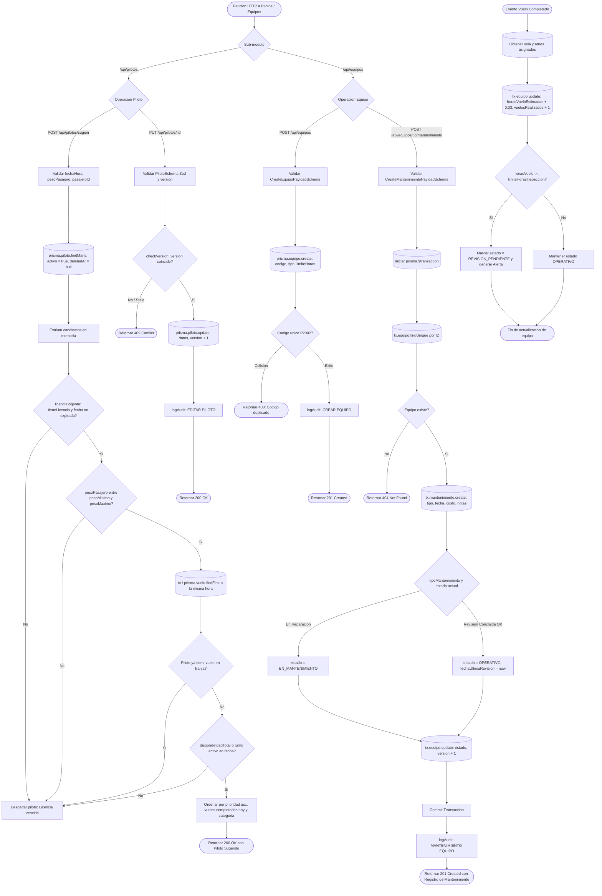

# Diagrama de Flujo: Módulo de Pilotos, Equipos y Mantenimiento

Este documento modela el flujo de ejecución técnica para la administración del personal de vuelo (pilotos, licencias y turnos de disponibilidad), asignación inteligente de cargas operativas, y el ciclo de vida y mantenimiento preventivo de equipos de parapente (velas, arneses y paracaídas) en **Parapente School**.

---

## 1. Diagrama de Flujo Técnico (`flowchart TD`)

---

## 2. Matriz de Referencia Cruzada: [Paso del Diagrama] -> [Código Fuente]

| Paso del Diagrama | Archivo / Ubicación | Función o Componente | Líneas de Código |
| :--- | :--- | :--- | :--- |
| **Punto de Entrada Pilotos** | `apps/api/src/controllers/pilotos.controller.ts` | `PilotosController` | [`L6-L45`](file:///home/zer0x/projects/paraglide/apps/api/src/controllers/pilotos.controller.ts#L6-L45) |
| **Sugerencia Inteligente de Piloto** | `apps/api/src/services/pilotos.service.ts` | `sugerirPiloto(payload)` | [`L93-L160`](file:///home/zer0x/projects/paraglide/apps/api/src/services/pilotos.service.ts#L93-L160) |
| **Validación de Licencia Vigente** | `apps/api/src/services/pilotos.service.ts` | `licenciaVigente(piloto)` | [`L8-L15`](file:///home/zer0x/projects/paraglide/apps/api/src/services/pilotos.service.ts#L8-L15) |
| **Control de Versión de Piloto** | `apps/api/src/services/pilotos.service.ts` | `update: checkVersion(actual.version)` | [`L80-L91`](file:///home/zer0x/projects/paraglide/apps/api/src/services/pilotos.service.ts#L80-L91) |
| **Punto de Entrada Equipos** | `apps/api/src/controllers/equipos.controller.ts` | `EquiposController` | [`L6-L70`](file:///home/zer0x/projects/paraglide/apps/api/src/controllers/equipos.controller.ts#L6-L70) |
| **Registro de Nuevo Equipo** | `apps/api/src/services/equipos.service.ts` | `create(data)` | [`L58-L82`](file:///home/zer0x/projects/paraglide/apps/api/src/services/equipos.service.ts#L58-L82) |
| **Detección Código Duplicado** | `apps/api/src/controllers/equipos.controller.ts` | `catch: error.code === 'P2002'` | [`L32-L37`](file:///home/zer0x/projects/paraglide/apps/api/src/controllers/equipos.controller.ts#L32-L37) |
| **Registro de Mantenimiento** | `apps/api/src/controllers/equipos.controller.ts` | `addMantenimiento(req, reply)` | [`L72-L84`](file:///home/zer0x/projects/paraglide/apps/api/src/controllers/equipos.controller.ts#L72-L84) |
| **Persistencia de Mantenimiento** | `apps/api/src/services/equipos.service.ts` | `addMantenimiento(id, data)` | [`L130-L155`](file:///home/zer0x/projects/paraglide/apps/api/src/services/equipos.service.ts#L130-L155) |
| **Paginación ADR 005 en Equipos** | `apps/api/src/services/equipos.service.ts` | `getAll: listar(opts, ...)` | [`L7-L40`](file:///home/zer0x/projects/paraglide/apps/api/src/services/equipos.service.ts#L7-L40) |
