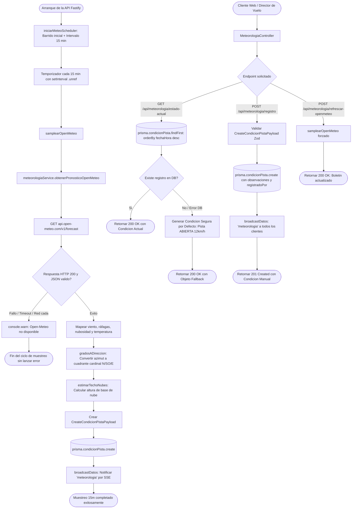

# Diagrama de Flujo: Módulo de Meteorología y Monitoreo de Pistas (Premium)

Este documento modela la arquitectura técnica del módulo premium de **Meteorología Operacional**, incluyendo el scheduler autónomo de sondeo a Open-Meteo, el cálculo y derivación del estado de pista (`ABIERTA`, `PRECAUCION`, `CERRADA`), la persistencia histórica en base de datos y la difusión de condiciones meteorológicas en tiempo real en **Parapente School**.

---

## 1. Diagrama de Flujo Técnico (`flowchart TD`)

---

## 2. Matriz de Referencia Cruzada: [Paso del Diagrama] -> [Código Fuente]

| Paso del Diagrama | Archivo / Ubicación | Función o Componente | Líneas de Código |
| :--- | :--- | :--- | :--- |
| **Inicio del Scheduler de Fondo** | `apps/api/src/services/meteoScheduler.service.ts` | `iniciarMeteoScheduler()` | [`L37-L43`](file:///home/zer0x/projects/paraglide/apps/api/src/services/meteoScheduler.service.ts#L37-L43) |
| **Función Sampler a Open-Meteo** | `apps/api/src/services/meteoScheduler.service.ts` | `samplearOpenMeteo()` | [`L21-L34`](file:///home/zer0x/projects/paraglide/apps/api/src/services/meteoScheduler.service.ts#L21-L34) |
| **Cliente de Red Open-Meteo** | `apps/api/src/services/openMeteo.service.ts` | `obtenerOpenMeteo()` | Service OpenMeteo |
| **Conversión de Grados a Cuadrantes**| `apps/api/src/services/openMeteo.service.ts` | `gradosADireccion(grados)` | Service OpenMeteo |
| **Estimación de Techo de Nubes** | `apps/api/src/services/openMeteo.service.ts` | `estimarTechoNubes(cobertura)` | Service OpenMeteo |
| **Servicio de Persistencia Meteo** | `apps/api/src/services/meteorologia.service.ts` | `registrar(data)` | [`L61-L77`](file:///home/zer0x/projects/paraglide/apps/api/src/services/meteorologia.service.ts#L61-L77) |
| **Consulta con Fallback Seguro** | `apps/api/src/services/meteorologia.service.ts` | `getUltimoEstado()` | [`L6-L46`](file:///home/zer0x/projects/paraglide/apps/api/src/services/meteorologia.service.ts#L6-L46) |
| **Rutas de la API** | `apps/api/src/routes/meteorologia.routes.ts` | `meteorologiaRoutes` | [`L4-L10`](file:///home/zer0x/projects/paraglide/apps/api/src/routes/meteorologia.routes.ts#L4-L10) |
| **Pantalla Pública TV de Pista** | `apps/api/src/routes/public.routes.ts` | `fastify.get('/pantalla')` | [`L463-L558`](file:///home/zer0x/projects/paraglide/apps/api/src/routes/public.routes.ts#L463-L558) |
