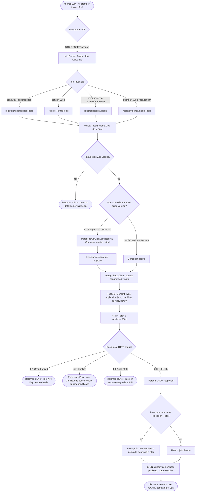

# Diagrama de Flujo: Módulo Servidor MCP (Integración IA con API Segura)

Este documento modela la arquitectura técnica y el ciclo de vida de peticiones del **Servidor Model Context Protocol (MCP)** en **Parapente School**, permitiendo a agentes LLM interactuar de forma segura con la API REST bajo el rol `RECEPCION`, respetando el control de concurrencia optimista (ADR 004), el contrato de sobres (ADR 005) y el soft-delete (ADR 006).

---

## 1. Diagrama de Flujo Técnico (`flowchart TD`)

---

## 2. Matriz de Referencia Cruzada: [Paso del Diagrama] -> [Código Fuente]

| Paso del Diagrama | Archivo / Ubicación | Función o Componente | Líneas de Código |
| :--- | :--- | :--- | :--- |
| **Inicialización del Servidor MCP** | `apps/mcp/src/server.ts` | `createMcpServer(client)` | [`L11-L26`](file:///home/zer0x/projects/paraglide/apps/mcp/src/server.ts#L11-L26) |
| **Cliente de Red Tipado con API Key** | `apps/mcp/src/client/api-client.ts` | `ParaglideApiClient.request<T>` | [`L12-L43`](file:///home/zer0x/projects/paraglide/apps/mcp/src/client/api-client.ts#L12-L43) |
| **Inyección de Header x-api-key** | `apps/mcp/src/client/api-client.ts` | `headers['x-api-key'] = this.apiKey` | [`L16-L18`](file:///home/zer0x/projects/paraglide/apps/mcp/src/client/api-client.ts#L16-L18) |
| **Herramienta Crear Reserva** | `apps/mcp/src/tools/reservas.ts` | `registerTool('crear_reserva')` | [`L9-L118`](file:///home/zer0x/projects/paraglide/apps/mcp/src/tools/reservas.ts#L9-L118) |
| **Herramienta Consultar Reserva** | `apps/mcp/src/tools/reservas.ts` | `registerTool('consultar_reserva')` | [`L120-L198`](file:///home/zer0x/projects/paraglide/apps/mcp/src/tools/reservas.ts#L120-L198) |
| **Desempaquetado de Sobres ADR 005** | `packages/shared/src/utils/unwrapList.ts` | `unwrapList(response)` | Shared unwrap utility |
| **Herramienta Disponibilidad** | `apps/mcp/src/tools/disponibilidad.ts` | `registerDisponibilidadTools` | Service disponibilidad |
| **Herramienta Cotizar y Tarifas** | `apps/mcp/src/tools/tarifas.ts` | `registerTarifasTools` | Service tarifas |
| **Control de Concurrencia en MCP** | `apps/mcp/src/tools/agendamiento.ts` | `getReserva -> inject version` | Service agendamiento |
