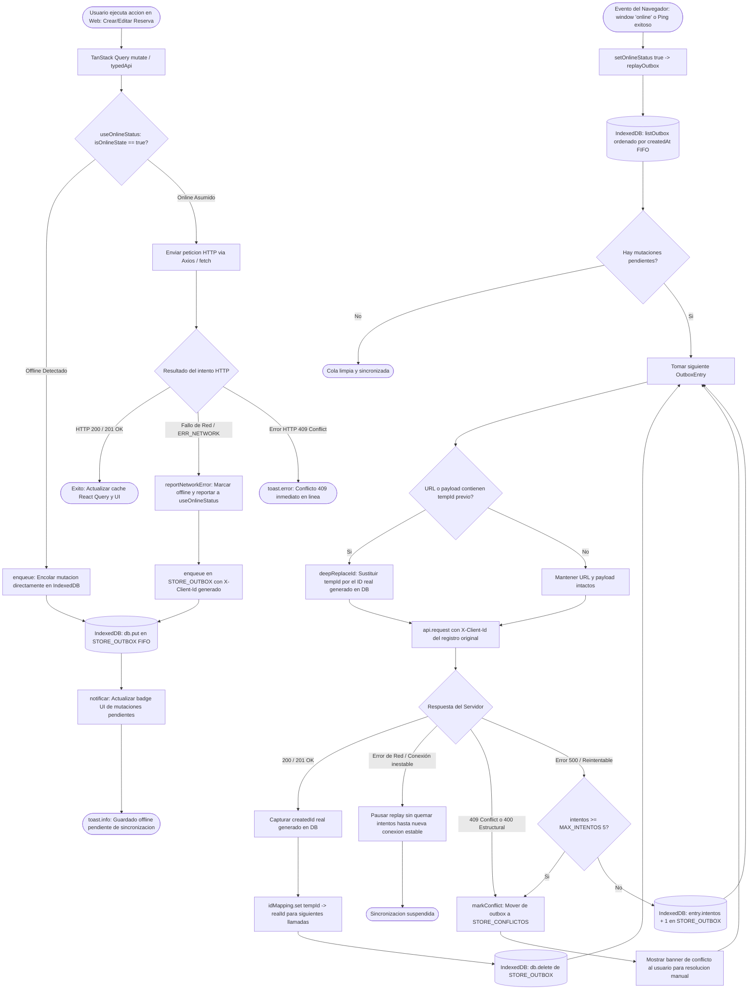

# Diagrama de Flujo: Módulo Frontend PWA Offline-First y Cola Outbox

Este documento modela el subsistema de resiliencia y funcionamiento sin conexión (**Offline-First - ADR 009**) en **Parapente School**, detallando la detección de red (`useSyncExternalStore`), la intercepción de mutaciones fallidas, el almacenamiento local en IndexedDB (`idb`), la cola FIFO con cabeceras de idempotencia (`X-Client-Id`), el remapeo dinámico de IDs temporales a reales, y la resolución de conflictos concurrentes (`409 Conflict`).

---

## 1. Diagrama de Flujo Técnico (`flowchart TD`)

---

## 2. Matriz de Referencia Cruzada: [Paso del Diagrama] -> [Código Fuente]

| Paso del Diagrama | Archivo / Ubicación | Función o Componente | Líneas de Código |
| :--- | :--- | :--- | :--- |
| **Detección Reactiva de Conectividad**| `apps/web/src/hooks/useOnlineStatus.ts` | `useSyncExternalStore + onlineManager` | [`L1-L37`](file:///home/zer0x/projects/paraglide/apps/web/src/hooks/useOnlineStatus.ts#L1-L37) |
| **Reporte Automático de Error de Red**| `apps/web/src/hooks/useOnlineStatus.ts` | `reportNetworkError()` | [`L40-L47`](file:///home/zer0x/projects/paraglide/apps/web/src/hooks/useOnlineStatus.ts#L40-L47) |
| **Inicialización IndexedDB (idb)** | `apps/web/src/services/outbox/outbox.service.ts` | `getDB()` | [`L12-L26`](file:///home/zer0x/projects/paraglide/apps/web/src/services/outbox/outbox.service.ts#L12-L26) |
| **Encolamiento con Idempotencia** | `apps/web/src/services/outbox/outbox.service.ts` | `enqueue(entry, opciones)` | [`L45-L59`](file:///home/zer0x/projects/paraglide/apps/web/src/services/outbox/outbox.service.ts#L45-L59) |
| **Listado FIFO de Mutaciones** | `apps/web/src/services/outbox/outbox.service.ts` | `listOutbox()` | [`L61-L65`](file:///home/zer0x/projects/paraglide/apps/web/src/services/outbox/outbox.service.ts#L61-L65) |
| **Función Maestra de Replay** | `apps/web/src/services/outbox/outbox.service.ts` | `replayOutbox(api)` | [`L153-L217`](file:///home/zer0x/projects/paraglide/apps/web/src/services/outbox/outbox.service.ts#L153-L217) |
| **Remapeo Dinámico de IDs Temporales**| `apps/web/src/services/outbox/outbox.service.ts` | `deepReplaceId(target, oldId, newId)` | [`L119-L139, L188-L213`](file:///home/zer0x/projects/paraglide/apps/web/src/services/outbox/outbox.service.ts#L119-L139) |
| **Detección de Caída de Red en Replay**| `apps/web/src/services/outbox/outbox.service.ts` | `isNetworkError(err)` | [`L141-L150, L218-L223`](file:///home/zer0x/projects/paraglide/apps/web/src/services/outbox/outbox.service.ts#L141-L150) |
| **Gestión de Conflictos 409** | `apps/web/src/services/outbox/outbox.service.ts` | `markConflict(entry, error, status)` | [`L73-L88, L235-L238`](file:///home/zer0x/projects/paraglide/apps/web/src/services/outbox/outbox.service.ts#L73-L88) |
| **Límite de Reintentos (Max 5)** | `apps/web/src/services/outbox/outbox.service.ts` | `MAX_INTENTOS & entry.intentos` | [`L151, L243-L250`](file:///home/zer0x/projects/paraglide/apps/web/src/services/outbox/outbox.service.ts#L151) |
