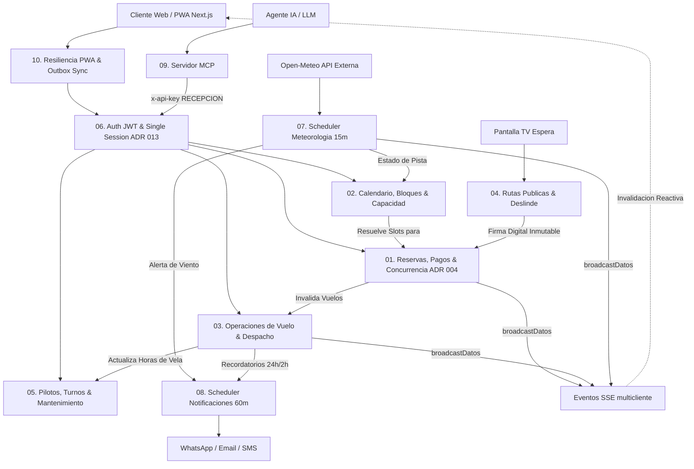

# 🗺️ Diagramas de Flujo Técnico de la Arquitectura — Parapente School

Este directorio constituye la especificación visual y técnica transversal de los flujos de ejecución del sistema **Parapente School**. Cada módulo cuenta con un diagrama formal en **Mermaid.js (`flowchart TD`)** y una **matriz de referencia cruzada** que vincula cada paso del flujo con la función y líneas de código exactas de la implementación.

---

## 🎨 Convenciones Visuales en Mermaid

Todos los diagramas siguen un estándar estricto para garantizar legibilidad, precisión arquitectónica y consistencia entre módulos:

| Elemento Visual | Sintaxis Mermaid | Significado Arquitectónico |
| :--- | :--- | :--- |
| **Inicio / Fin de Flujo** | `([ Texto ])` | Punto de entrada (Request del cliente, evento del scheduler) o término de ejecución (HTTP Response, confirmación). |
| **Decisión / Bifurcación** | `{ Texto }` | Condicionales lógicos (`if/else`, validaciones de Zod, comprobación de concurrencia `version`, guards de estado). |
| **Operación / Mutación** | `[ Texto ]` | Procesamiento en memoria, transformaciones, cálculo de tarifas, hashing y derivación de estados. |
| **Persistencia / I/O Asíncrono**| `[( Texto )]` | Operaciones de base de datos (Prisma `$transaction`, queries Postgres, IndexedDB, APIs externas). |
| **Ramas Condicionales** | `-- Si -->`, `-- No -->`, `-- Error -->` | Etiquetas explícitas de transición para cada camino de ejecución posible. |

---

## 🏛️ Mapa de Interacción Arquitectónica Global

---

## 📑 Catálogo de Flujos Técnicos por Módulo

| Módulo | Documento de Flujo | Dominio y Responsabilidad Principal | Archivos Fuente Clave |
| :--- | :--- | :--- | :--- |
| **🌟 E2E Master** | [`reserva_vuelo_lifecycle_process_map.md`](./reserva_vuelo_lifecycle_process_map.md) | **Macroproceso End-to-End**: De la reserva al vuelo, deslinde digital táctil, matching por pesos, concurrencia híbrida, outbox offline y liquidación. | Arquitectura global (todas las capas) |
| **01. Reservas & Pagos** | [`01_reservas_pagos_flow.md`](./01_reservas_pagos_flow.md) | Ciclo de vida de reservas, cálculo de tarifas con `Decimal(12,2)`, abonos, derivación automática de estados y concurrencia optimista (`version Int`). | `reservas.controller.ts` `reservas.crud.ts` `reservas.ciclo-vida.ts` |
| **02. Calendario & Slots** | [`02_calendario_slots_flow.md`](./02_calendario_slots_flow.md) | Capacidad horaria, jerarquía de bloques (INDEFINIDO -> RANGO -> EXACTA), no solapamiento y feeds iCalendar HMAC-SHA256. | `configuracionBloques.ts` `calendar.service.ts` `configuracion.service.ts` |
| **03. Vuelos & Despacho** | [`03_vuelos_despacho_flow.md`](./03_vuelos_despacho_flow.md) | Asignación automática por pesos, agendamiento grupal atómico, bloqueo `SELECT FOR UPDATE` y máquina de estados. | `vuelos.controller.ts` `vuelos.matching.ts` `vuelos.lifecycle.ts` |
| **04. Pasajeros & Deslindes**| [`04_pasajeros_deslindes_flow.md`](./04_pasajeros_deslindes_flow.md) | Tokens públicos no secuenciales, captura táctil de firma Base64, inmutabilidad legal y actualización a apto para vuelo. | `public.routes.ts` `deslindes.ts` `deslinde/[token]/page.tsx` |
| **05. Pilotos & Equipos** | [`05_pilotos_equipos_flow.md`](./05_pilotos_equipos_flow.md) | Licencias vigentes, turnos, balanceo de carga de pilotos, historial de velas y alertas preventivas de inspección. | `pilotos.service.ts` `equipos.service.ts` `equipos.controller.ts` |
| **06. Auth & Sesión Única** | [`06_auth_single_session_flow.md`](./06_auth_single_session_flow.md) | Login bcrypt/OAuth2, incremento de `sessionVersion` (ADR 013), middleware Next.js y autorización por roles RBAC. | `auth.service.ts` `plugins/auth.ts` `web/middleware.ts` |
| **07. Meteorología & Pistas**| [`07_meteorologia_alertas_flow.md`](./07_meteorologia_alertas_flow.md) | Sampler de Open-Meteo cada 15 min, semáforo de pista (ABIERTA/CERRADA), fallback seguro y pantalla TV. | `meteoScheduler.service.ts` `meteorologia.service.ts` `openMeteo.service.ts` |
| **08. Notificaciones** | [`08_notificaciones_plantillas_flow.md`](./08_notificaciones_plantillas_flow.md) | Scheduler cada 60 min, ventanas de 24h y 2h, motor de plantillas seguras y despacho omnicanal (WhatsApp/Email). | `notificacionesScheduler.service.ts` `notificaciones.service.ts` `plantillas.service.ts` |
| **09. Servidor MCP** | [`09_mcp_server_flow.md`](./09_mcp_server_flow.md) | Integración para agentes IA, transporte STDIO/SSE, cliente HTTP Fastify tipado, auth por API Key y desempaque ADR 005. | `server.ts` `client/api-client.ts` `tools/reservas.ts` |
| **10. PWA & Outbox Offline** | [`10_pwa_offline_outbox_flow.md`](./10_pwa_offline_outbox_flow.md) | Detección reactiva de red, cola FIFO en IndexedDB con `X-Client-Id`, remapeo de IDs temporales y resolución de 409. | `useOnlineStatus.ts` `outbox.service.ts` |
