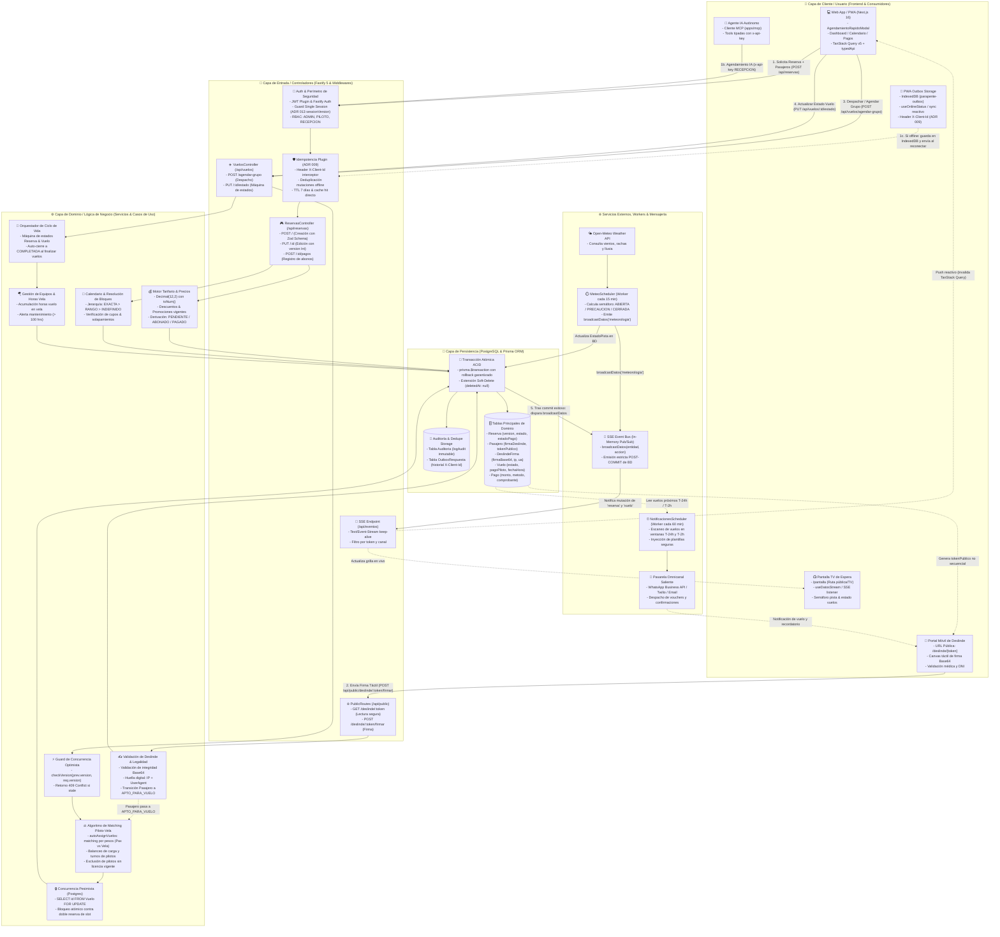
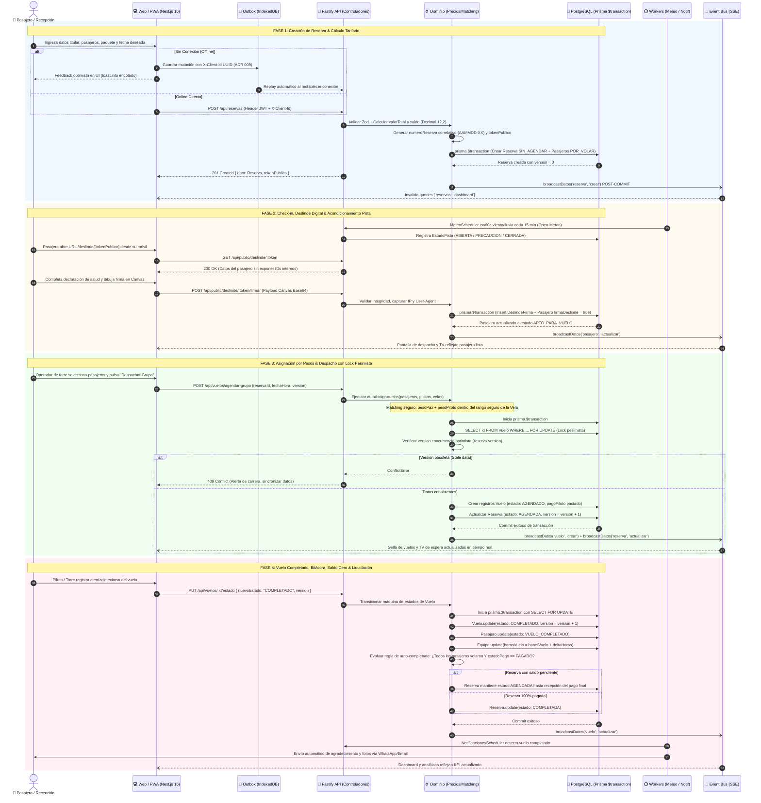

# 🗺️ Mapa de Procesos End-to-End: Ciclo de Vida de Reserva a Vuelo y Liquidación

> **Rol**: Arquitectura de Soluciones & Análisis de Sistemas  
> **Sistema**: Parapente School (Booking & Flight Operations Core)  
> **Patrones Clave**: CQRS-lite, Concurrencia Híbrida (Optimista `version` + Pesimista `SELECT FOR UPDATE`), Idempotencia Outbox (ADR 009), Single Session (ADR 013), Event-Driven UI (SSE post-commit).

---

## 1. Resumen Ejecutivo y Visión del Macroproceso

El proceso medular del sistema **Parapente School** comprende la transformación integral de una intención comercial de vuelo en una operación aeronáutica ejecutada de manera segura, conforme a las normativas de deslinde legal, con asignación automatizada de recursos (pilotos y parapentes según umbrales de peso), control estricto de concurrencia y cierre financiero auditado sin redondeos espurios (`Decimal(12,2)`).

El flujo atraviesa **5 capas arquitectónicas** conectando múltiples actores: pasajeros que firman su deslinde en smartphones, recepcionistas que gestionan reservas y pagos en la PWA (incluso sin conexión gracias a una cola Outbox en IndexedDB), la torre de control que supervisa vuelos en tiempo real mediante Server-Sent Events (SSE), y agentes de IA que interactúan a través de un servidor Model Context Protocol (MCP).

---

## 2. Mapa de Procesos End-to-End (Swimlanes por Capas)

---

## 3. Trazabilidad Temporal: Secuencia del Ciclo de Vida End-to-End

El siguiente diagrama detalla la correlación temporal y el paso de mensajes a través de las capas durante las **4 etapas cardinales** de la operación:

---

## 4. Matriz de Transición de Estados de Entidades Clave

El sistema orquesta estados concurrentes acoplados a reglas de negocio inmutables:

| Entidad | Estado Inicial | Transiciones Posibles | Estado Final | Regla / Detonante del Sistema |
| :--- | :--- | :--- | :--- | :--- |
| **Reserva** | `SIN_AGENDAR` | `→ AGENDADA` `→ CANCELADA` | `COMPLETADA` | Pasa a `AGENDADA` cuando sus vuelos son programados. Solo transiciona a `COMPLETADA` si **todos** sus pasajeros tienen estado `VUELO_COMPLETADO` y el `estadoPago` es `PAGADO`. |
| **Estado Pago** | `PENDIENTE` | `→ ABONADO` `→ PAGADO` `→ DEVUELTO` | `PAGADO` / `DEVUELTO` | Calculado estrictamente con `toNum()` sobre `Decimal(12,2)`: Si `abono == 0` es `PENDIENTE`; si `0 < abono < valorTotal` es `ABONADO`; si `abono >= valorTotal` es `PAGADO`. Si `montoDevuelto > 0` deriva a `DEVUELTO`. |
| **Pasajero** | `POR_VOLAR` | `→ VUELO_COMPLETADO` `→ CANCELADO` | `VUELO_COMPLETADO` | Requiere `firmaDeslinde: true` (`APTO_PARA_VUELO`) para habilitar el despegue en el algoritmo de matching. |
| **Vuelo** | `AGENDADO` | `→ COMPLETADO` `→ CANCELADO` | `COMPLETADO` | Controlado por `SELECT FOR UPDATE` en Postgres para evitar condiciones de carrera en el slot del piloto (`@@unique([pilotoId, fechaHora])`). |
| **Pista (Meteo)** | `ABIERTA` | `→ PRECAUCION` `→ CERRADA` | Dinámico | Evaluado cada 15 min por `MeteoScheduler` contra umbrales meteorológicos de viento (> 35 km/h = CERRADA) y lluvia. |

---

## 5. Entradas y Salidas de Negocio (Inputs & Outputs)

### 📥 Entradas de Negocio (Business Inputs)
1. **Solicitud de Reserva**: Nombre y RUT/DNI del titular, email, teléfono, fecha/rango deseado, paquete de vuelo y nómina de pasajeros (nombre, peso estimado en kg, teléfonos).
2. **Registro de Abonos / Pagos**: Monto en `Decimal(12,2)`, método de pago (`TRANSFERENCIA`, `WEBPAY`, `EFECTIVO`, `TARJETA`), identificador de transacción bancaria o comprobante.
3. **Deslinde Legal Táctil**: Trazo vectorial / imagen en Base64 de la firma del pasajero, declaración jurada médica (enfermedades cardíacas, cirugías recientes, embarazo), huella de auditoría del navegador (dirección IP del cliente y User-Agent).
4. **Parámetros Operativos de Despacho**: Selección de slot temporal en bloque horario, asignaciones manuales o sugeridas por el motor de matching de pilotos y números de serie de velas.
5. **Telemetría Meteorológica**: Datos en tiempo real de la API Open-Meteo (velocidad de viento base en km/h, rachas máximas, dirección cardinal en grados y probabilidad de precipitación).

### 📤 Salidas de Negocio (Business Outputs)
1. **Identificadores y Tokens Seguros**:
   - `numeroReserva`: Código correlativo único institucional en formato `AAMMDD-XX` (con control de colisión y reintentos P2002 con jitter).
   - `tokenPublico` & `shortId`: Hashes no secuenciales para consulta de deslinde y voucher público sin fugar IDs secuenciales de base de datos.
2. **Expediente de Deslinde Legal Digital**: Documento legal inmutable con firma estampada, timestamp verificado, versión de bases y condiciones, e IP de captura para blindaje ante reclamaciones legales.
3. **Hoja de Despacho y Asignación Aeronáutica**: Asignaciones validadas respetando el peso máximo de despegue (MTOW) de cada vela y balanceando las horas de fatiga entre los pilotos de turno.
4. **Liquidación y Bitácora de Vuelo**:
   - Registro de minutos/horas de vuelo sumados a la vela (con disparo de alertas de inspección periódica a las 100 horas).
   - Abono de honorarios al piloto (`pagoPiloto`) registrado para el cierre de caja de la jornada.
5. **Sincronización Reactiva Multicliente**: Broadcast SSE (`datos-cambios`) que actualiza la TV de la sala de espera y las sesiones de administración concurrentes en < 100 ms sin sobrecargar con polling innecesario.
6. **Despacho Omnicanal**: Notificaciones automatizadas de confirmación y recordatorio a las 24 horas y 2 horas previas enviadas al pasajero vía WhatsApp / Email.

---

## 6. Módulos y Directorios del Proyecto Involucrados

| Etapa del Proceso | Módulos & Directorios Clave | Archivos Específicos | Responsabilidad Técnica |
| :--- | :--- | :--- | :--- |
| **Frontend, PWA & Resiliencia** | `apps/web/src/app` `apps/web/src/components` `apps/web/src/services/outbox` `apps/web/src/hooks` | `reservas/page.tsx` `AgendamientoRapidoModal.tsx` `outbox.service.ts` `useOnlineStatus.ts` `useDatosStream.ts` | Captura UI, gestión de caché con TanStack Query v5, resiliencia offline en IndexedDB con deduplicación por `X-Client-Id` y suscripción al canal SSE. |
| **Portal Público de Deslinde** | `apps/web/src/app/deslinde` `apps/web/src/components/deslinde` | `[token]/page.tsx` `CanvasFirma.tsx` | Renderizado responsive móvil, captura de firma táctil y envío desacoplado sin requerir login de usuario. |
| **Control de Acceso & Perímetro** | `apps/api/src/plugins` `apps/api/src/services` | `plugins/auth.ts` `plugins/idempotencia.plugin.ts` `auth.service.ts` | Validación de JWT, verificación de sesión única (`sessionVersion` ADR 013), control de idempotencia de mutaciones offline (ADR 009). |
| **Gestión de Reservas y Pagos** | `apps/api/src/routes` `apps/api/src/services/reservas` `packages/shared/src` | `routes/reservas.ts` `reservas.crud.ts` `reservas.ciclo-vida.ts` `reservas.precios.ts` `money.util.ts` | Validación con esquemas Zod, cálculo de tarifas con `Decimal(12,2)`, correlativo `AAMMDD-XX`, y derivación de estados de pago. |
| **Deslindes & Pasajeros** | `apps/api/src/routes` `apps/api/src/services` | `routes/deslindes.ts` `routes/public.routes.ts` `pasajeros.service.ts` | Recepción de firmas en Base64, inmutabilidad jurídica y paso de pasajeros a estado apto para vuelo. |
| **Operaciones de Vuelo & Despacho**| `apps/api/src/routes` `apps/api/src/services/vuelos` | `routes/vuelos.ts` `vuelos.crud.ts` `vuelos.matching.ts` `vuelos.lifecycle.ts` | Algoritmo de asignación por peso, bloqueo de concurrencia pesimista (`FOR UPDATE`), máquina de estados de vuelo y cierre de reservas. |
| **Equipos, Velas & Pilotos** | `apps/api/src/services` | `equipos.service.ts` `pilotos.service.ts` | Control de horas acumuladas de las velas, control de inspección preventiva y tarifas/turnos de los pilotos. |
| **Persistencia & Modelo de Datos** | `apps/api/prisma` | `schema.prisma` `prisma.ts` | Esquema relacional PostgreSQL, llaves compuestas (`@@unique([pilotoId, fechaHora])`), soft-delete automático y transacciones ACID. |
| **Meteorología & Workers de Fondo** | `apps/api/src/services` | `openMeteo.service.ts` `meteorologia.service.ts` `meteoScheduler.service.ts` | Polling periódico (15 min) a Open-Meteo, derivación de semáforo de pista y persistencia de métricas atmosféricas. |
| **Notificaciones Omnicanal** | `apps/api/src/services` | `notificacionesScheduler.service.ts` `notificaciones.service.ts` `plantillas.service.ts` | Worker cada 60 min, detección de ventanas horarias (24h/2h) y ensamblado de plantillas seguras. |
| **Servidor MCP (Agentes IA)** | `apps/mcp/src` | `server.ts` `client/api-client.ts` `tools/reservas.ts` | Exposición de herramientas estructuradas vía JSON-RPC sobre stdio/SSE para agentes inteligentes con rol `RECEPCION`. |
