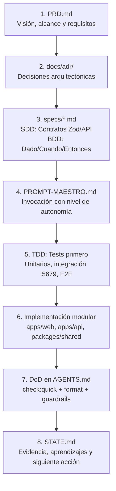

# Marco de Gobernanza del Monorepo — Paraglide

Este documento establece el marco formal de gobernanza y desarrollo asistido por agentes para el proyecto **Paraglide** (Sistema de reservas y operaciones para escuela de parapente).

---

## 1. La Matriz de Gobernanza (7 Pilares)

El desarrollo en este repositorio sigue una disciplina estricta de 7 capas que garantiza trazabilidad desde la visión de negocio hasta la ejecución y el aprendizaje continuo:

| Elemento | Dónde vive | Función |
|---|---|---|
| **PRD** | [`PRD.md`](../PRD.md) | Alcance de la entrega, usuarios, requisitos funcionales/no funcionales y criterios de aceptación final. |
| **ADR** | [`docs/adr/`](./adr/README.md) | Decisiones arquitectónicas significativas, consensuadas e inmutables una vez aprobadas. |
| **Prompt Maestro** | [`PROMPT-MAESTRO.md`](../PROMPT-MAESTRO.md) | Plantilla de invocación, referencia al PRD/Spec y nivel de autonomía autorizada para agentes. |
| **SDD + BDD** | [`specs/`](../specs/README.md) | Especificaciones de diseño: contratos (DTOs/Zod/OpenAPI), límites de negocio y escenarios Dado/Cuando/Entonces (*Given/When/Then*). |
| **TDD** | Pruebas e implementación | Verificar el comportamiento mediante tests unitarios e integración antes y durante la codificación. |
| **DoD** | [`AGENTS.md`](../AGENTS.md) (Sección 6) | Definición de Terminado personalizada con las condiciones comunes de calidad y cierre del proyecto. |
| **Seguimiento** | [`STATE.md`](../STATE.md) y [`.agents/memories/`](../.agents/memories/) | Evidencia de ejecución, estado de la iteración, pendientes inmediatos y registro de aprendizajes continuos. |

---

## 2. Flujo de Trabajo Operativo (Ciclo E2E)

### Detalle de cada Fase

1. **Definición de Alcance (PRD)**:
   - Todo cambio relevante o nueva funcionalidad debe estar alineado con los objetivos de [`PRD.md`](../PRD.md).
   - Se definen los roles de usuario (Pasajero, Piloto, Recepción, Admin) y el valor de negocio.

2. **Decisión de Arquitectura (ADR)**:
   - Si la funcionalidad introduce un cambio estructural (estrategia de persistencia, colas, protocolo de tiempo real, seguridad), se documenta un nuevo ADR en [`docs/adr/`](./adr/README.md).
   - El agente `auditor-adr` audita cambios contra los ADRs existentes (001 a 015).

3. **Especificación Guiada por Diseño y Comportamiento (SDD + BDD)**:
   - Antes de codificar, se crea o consulta una spec en [`specs/`](../specs/README.md).
   - **SDD (Spec-Driven Development)**: Define esquemas Zod en `@parapente/shared`, métodos HTTP, códigos de retorno y límites de validación.
   - **BDD (Behavior-Driven Development)**: Expresa los casos de uso en lenguaje ubicuo mediante escenarios Gherkin:
     - `Dado`: El estado inicial del sistema (e.g., reserva existente con versión `v1`).
     - `Cuando`: La acción que ocurre (e.g., dos clientes envían actualización simultánea).
     - `Entonces`: El resultado observable (e.g., el primero actualiza a `v2`, el segundo recibe `HTTP 409 Conflict`).

4. **Invocación y Control de Autonomía (Prompt Maestro)**:
   - Las sesiones de desarrollo de agentes se inician utilizando la estructura de [`PROMPT-MAESTRO.md`](../PROMPT-MAESTRO.md).
   - Se explicita el nivel de autonomía (L1: Plan, L2: Guiado, L3: Autónomo Estándar, L4: Full Autonomous).

5. **Desarrollo Guiado por Pruebas (TDD)**:
   - Los escenarios BDD se traducen directamente a pruebas automatizadas:
     - **Unitarias**: Mocks de Fastify/Prisma en `apps/api` o Vitest en `apps/web`.
     - **Integración**: Postgres real en Dev (`:5679`) mediante `npm run test:api:integration`.
     - **E2E**: Playwright en `apps/web/tests`.
   - Se sigue el ciclo Red (falla) ➔ Green (pasa) ➔ Refactor.

6. **Definición de Terminado (DoD)**:
   - Ninguna tarea se da por cerrada sin verificar todos los puntos del DoD en [`AGENTS.md`](../AGENTS.md).
   - Gate principal mandatorio: `npm run check:quick` con salida 0.

7. **Registro de Estado y Aprendizaje Continuo (STATE)**:
   - Al finalizar la sesión, se actualiza [`STATE.md`](../STATE.md) documentando la evidencia de pruebas, los archivos tocados, los elementos en progreso y los nuevos aprendizajes o gotchas detectados.

---

## 3. Matriz de Roles y Agentes

| Entidad | Responsabilidad Principal | Artefactos Clave |
|---|---|---|
| **Desarrollador Humano** | Aprobación de PRDs, selección de nivel de autonomía, revisión de PRs. | `PRD.md`, `PROMPT-MAESTRO.md` |
| **Agente Autónomo** (`agente-autonomo`) | Ejecución integral del ciclo TDD ➔ Implementación ➔ Gate ➔ DoD. | `STATE.md`, código, tests |
| **db-schema-guardian** | Integridad de `schema.prisma`, migraciones y soft-delete. | `apps/api/prisma/` |
| **api-contract-enforcer** | Cumplimiento del ADR 005 (`listar()`, `unwrapList`, DTOs). | `packages/shared`, `apps/api` |
| **auditor-adr** | Auditoría de solo lectura contra decisiones arquitectónicas. | `docs/adr/` |
| **web-ui-guardrails** | Calidad UI en Next.js 16, Tailwind v4, PWA y outbox offline. | `apps/web/` |
| **e2e-flake-guard** | Resiliencia de pruebas Playwright y aislamiento de `/api`. | `apps/web/tests/` |
| **release-ops** | Staging (`:3200`), despliegues y conventional commits. | Staging, scripts de deploy |
| **mcp-server-dev** | Tools y contratos del servidor MCP. | `apps/mcp/` |

---

## 4. Guardrails Inmutables de Paraglide

1. **Aislamiento de Bases de Datos**:
   - Dev corre en el puerto **5679** (`docker-compose.dev-db.yml`).
   - Staging corre en el puerto **5680** (`docker-compose.staging.yml`).
   - 🚨 **PROHIBIDO tocar el puerto 5678** (Producción).
2. **Finanzas y Dinero**:
   - Manejo obligatorio con `toNum()` de `money.util.ts` (`Decimal(12,2)`). Prohibidos operadores nativos JS sobre `Decimal`.
3. **Control de Concurrencia**:
   - Todo cambio a reservas y entidades compartidas valida `version Int` y retorna `409 Conflict` ante discrepancias (ADR 004).
4. **Soft Delete**:
   - Respetar siempre `deletedAt: null` garantizado por Prisma Extensions (ADR 006).
5. **Formateo Incremental**:
   - Ejecutar `npm run format` (afecta únicamente archivos cambiados en git; `.md` no se formatea).
