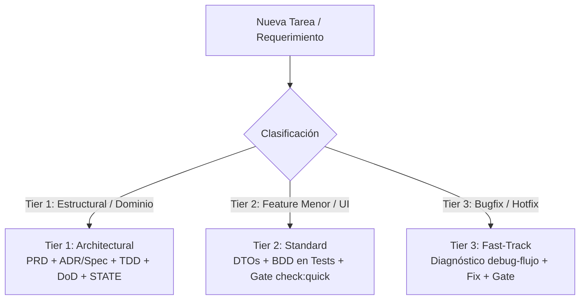

# Marco de Gobernanza del Monorepo — Paraglide

Este documento establece el marco formal de gobernanza y desarrollo asistido por agentes para el proyecto **Paraglide** (Sistema de reservas y operaciones para escuela de parapente).

---

## 1. La Matriz de Gobernanza (7 Pilares)

El desarrollo en este repositorio sigue una disciplina de 7 capas que garantiza trazabilidad desde la visión de negocio hasta la ejecución técnica y el aprendizaje continuo:

| Elemento | Dónde vive | Función |
|---|---|---|
| **PRD** | [`PRD.md`](../PRD.md) | Alcance de producto, usuarios, requisitos funcionales/no funcionales y criterios de aceptación. |
| **ADR** | [`docs/adr/`](./adr/README.md) | Decisiones arquitectónicas significativas e inmutables una vez consensuadas. |
| **Prompt Maestro** | [`PROMPT-MAESTRO.md`](../PROMPT-MAESTRO.md) | Plantilla de invocación ágil, asignación de Tier y nivel de autonomía autorizada. |
| **SDD + BDD** | [`specs/`](../specs/README.md) | Especificaciones vivas: contratos en `@parapente/shared`, límites de negocio y escenarios Dado/Cuando/Entonces. |
| **TDD** | Pruebas e implementación | Verificar el comportamiento mediante tests unitarios e integración antes y durante la codificación. |
| **DoD** | [`AGENTS.md`](../AGENTS.md) (Sección 6) | Definición de Terminado canónica con las condiciones de calidad y cierre del proyecto. |
| **Seguimiento** | [`STATE.md`](../STATE.md) y [`.agents/memories/`](../.agents/memories/) | Estado macro del roadmap, post-mortems y registro de aprendizajes continuos. |

---

## 2. Clasificación de Tareas por Niveles (Governance Tiering)

Para evitar la sobreingeniería y burocracia documental en cambios menores, el flujo de trabajo se divide en 3 niveles de rigor proporcionado:

### Tabla de Aplicación de Tiers

| Nivel | Alcance del Cambio | Artefactos Exigidos | Proceso de Ejecución |
|---|---|---|---|
| **Tier 1 (Architectural)** | Nuevo módulo, cambio en `schema.prisma`, cambios en flujos de cobro/concurrencia, integraciones externas críticas. | Spec formal en `specs/` (o nuevo ADR), actualización de PRD y `STATE.md`. | Ciclo completo de 7 capas. Aprobación humana de especificación previa a implementación. |
| **Tier 2 (Standard)** | Nuevos endpoints CRUD/filtros, nuevos componentes/modales UI, flujos habituales. | DTO en `packages/shared`, test unitario con BDD integrado. | 1. Compilar `@parapente/shared`. 2. BDD expresado en los tests (`it('Dado... Cuando... Entonces...')`). 3. Implementación y gate `check:quick`. |
| **Tier 3 (Fast-Track)** | Bugfixes, tests rotos, ajustes CSS/Tailwind, erratas, refactors internos sin cambio de contrato. | Cero artefactos documentales nuevos. Solo código y test de regresión. | 1. Diagnóstico sistemático con skill `debug-flujo`. 2. Test de regresión. 3. Fix mínimo + gate `check:quick`. |

---

## 3. Flujo de Trabajo Operativo Detallado

### Para Cambios Estructurales (Tier 1)
1. **Definición de Alcance (PRD)**: Alinear con [`PRD.md`](../PRD.md).
2. **Decisión de Arquitectura (ADR)**: Si introduce nuevas dependencias, colas o protocolos, redactar ADR en [`docs/adr/`](./adr/README.md).
3. **Living Spec (SDD + BDD)**: Crear spec compacta con [`specs/TEMPLATE.md`](../specs/TEMPLATE.md). Referenciar esquemas canónicos en `packages/shared`.
4. **Invocación Ágil**: Iniciar sesión indicando `Tier 1` y nivel de autonomía (L1 a L4).
5. **TDD & Gate**: Implementar tests primero, compilar con `npm run build:shared`, validar con `npm run check:quick`.
6. **Cierre y STATE**: Verificar DoD en [`AGENTS.md`](../AGENTS.md) y actualizar [`STATE.md`](../STATE.md).

### Para Tareas Cotidianas (Tier 2 y Tier 3)
1. Invocar al agente especificando el objetivo y el nivel de autonomía:
   `Objetivo: [X] | Tier: [2 o 3] | Autonomía: [L2 o L3]`
2. Ejecutar ciclo de desarrollo enfocado en código y pruebas.
3. El agente formatea incrementalmente con `npm run format` y valida con `npm run check:quick`.

---

## 4. Matriz de Roles y Agentes

| Entidad | Responsabilidad Principal | Ámbito |
|---|---|---|
| **Desarrollador Humano** | Aprobación de PRDs/ADRs, selección de Tier/Autonomía, revisión de PRs. | Arquitectura & Negocio |
| **Agente Autónomo** (`agente-autonomo`) | Ciclo integral: Diagnóstico ➔ Implementación ➔ Formato ➔ Gate `check:quick`. | Full-stack |
| **Debug de Flujo** (`debug-flujo`) | Resolución sistemática de incidencias y tests fallidos en máximo 3 lotes. | Diagnóstico rápido |
| **db-schema-guardian** | Esquema Prisma, migraciones, índices y regla de aislamiento de DB. | `apps/api/prisma/` |
| **api-contract-enforcer** | Contratos de colección (ADR 005), helper `listar()`, DTOs y vistas públicas. | `packages/shared`, `apps/api` |
| **auditor-adr** | Auditoría estricta contra decisiones arquitectónicas 001 a 015. | Solo lectura |
| **web-ui-guardrails** | Next.js 16, Tailwind v4, TanStack Query y outbox offline (`isQueuedError`). | `apps/web/` |
| **e2e-flake-guard** | Resiliencia Playwright y catch-all neutro de `/api/` (`mockAppShellApi`). | `apps/web/tests/` |
| **release-ops** | Staging (`:3200`), diagnósticos HTTP y Conventional Commits. | Operaciones |

---

## 5. Guardrails Inmutables de Paraglide

1. **Aislamiento de Bases de Datos**:
   - Dev corre en el puerto **5679** (`docker-compose.dev-db.yml`).
   - Staging corre en el puerto **5680** (`docker-compose.staging.yml`).
   - 🚨 **PROHIBIDO tocar el puerto 5678** (Producción).
2. **Finanzas y Dinero**:
   - Manejo obligatorio con `toNum()` de `money.util.ts` (`Decimal(12,2)`). Prohibidos operadores nativos JS sobre `Decimal`.
3. **Control de Concurrencia**:
   - Todo cambio a reservas y entidades compartidas valida `version Int` y retorna `HTTP 409 Conflict` ante discrepancias (ADR 004).
4. **Soft Delete**:
   - Respetar siempre `deletedAt: null` garantizado por Prisma Extensions (ADR 006).
5. **Formateo Incremental**:
   - Ejecutar `npm run format` (afecta únicamente archivos cambiados en git; `.md` no se formatea).
