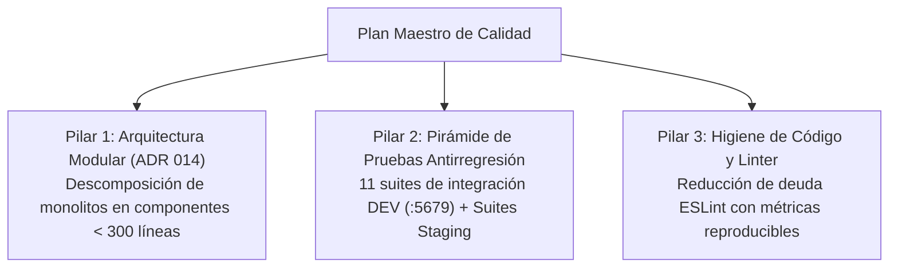
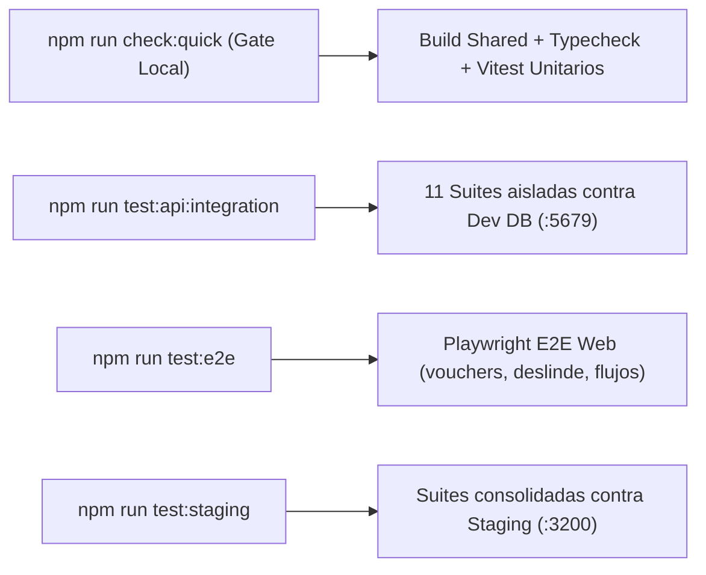

# 🛠️ Plan Maestro de Calidad Técnica y Refactorización

Documento unificado de calidad técnica, arquitectura modular, higiene de código y fortalecimiento de pruebas para el monorepo **Paraglide**. Consolida y reemplaza los antiguos planes dispersos (`plan-refactor-agent-friendly`, `plan-refactor-tests-y-suites` y `roadmap-lint-higiene`).

---

## 🎯 Visión General: Los 3 Pilares de Calidad

---

## 🏛️ Pilar 1: Arquitectura Modular "Agent-Friendly" (ADR 014)

### Objetivo
Descomponer archivos monolíticos (> 300 líneas) en módulos atómicos de responsabilidad única (< 200–300 líneas) para maximizar la velocidad de razonamiento de los LLM/agentes, evitar desbordes de contexto y prevenir colisiones de edición.

### Reglas de Diseño
1. **Patrón Headless Controller Hook + Componente Presentacional**:
   - Componentes UI: solo renderizado JSX, Tailwind v4, accesibilidad y eventos.
   - Controller Hooks (`use*Controller`): gestión de datos TanStack Query/Outbox, modales y validación Zod.
2. **Sub-hooks Atómicos (< 300 líneas)**:
   - `use*Data`: fetching, paginación, filtros.
   - `use*Modal`: visibilidad y formularios de diálogos.
   - `use*Events`: callbacks y efectos colaterales.

### Estado de Candidatos Críticos

| Módulo / Archivo | Estado | Acción Realizada / Pendiente |
| :--- | :---: | :--- |
| `admin/users/` | ✅ Completado | Separado en `UsersTable`, `UserEditModal`, `useUsersController`. |
| `equipos/` | ✅ Completado | Separado en `EquiposListTable`, `EquipoModal`, `useEquiposController`. |
| `packages/shared/src/index.ts` | ✅ Completado | Dividido en `src/schemas/` por dominio (`reservas`, `pilotos`, etc.). |
| `apps/web/src/app/reservas/page.tsx` | ✅ Completado | Desacoplado en `ReservasTable`, `ReservasFilters`, `ReservasModals` y sub-componentes. |
| `apps/web/src/app/calendario/page.tsx` | ✅ Completado | Desacoplado en `CalendarioView`, `CalendarioHeader`, `CalendarioModals` y sub-componentes. |
| `apps/web/src/app/calendario/components/VueloModal.tsx` | ✅ Completado | Descompuesto en `VueloModalHeader`, `VueloModalDateTime`, `VueloModalSingleAssign`, `VueloModalFinancialDetail` y `VueloModalSelectReserva`. |
| `apps/web/src/app/voucher/[id]/page.tsx` | ✅ Completado | Desacoplado en `useVoucherController` y componentes atómicos (`VoucherHeader`, `VoucherFlightCard`, `VoucherPassengerList`, etc.). |
| `apps/web/src/app/reservas/components/ReservaCard.tsx` | ✅ Completado | Descompuesto en `ReservaCardHeader`, `ReservaCardMenu`, `ReservaCardFinancials`, `ReservaCardPassengerList` y `ReservaCardActions`. |
| `apps/web/src/components/PagosModal.tsx`| ✅ Completado | Descompuesto en `src/components/pagos/` con métodos de pago y calculador de saldos. |
| `apps/web/src/app/analiticas/page.tsx` | ✅ Completado | Desacoplado en `useAnaliticasController` y componentes atómicos (`AnaliticasHeader`, `AnaliticasSummaryCards`, `AnaliticasDemandaChart`, `AnaliticasPilotosList`, `AnaliticasGastosBreakdown`, `AnaliticasGastoModal`). |
| `apps/web/src/app/calendario/VistaAgendas.tsx` | ✅ Completado | Desacoplado en `usePilotosDisponibilidadEfectiva` y componentes atómicos (`AgendaNavHeader`, `AgendaTarjetaVuelo`, `AgendaCarril`, `AgendaEstadoVacio`, `AgendaVuelosFueraBloque`, `AgendaBloqueHorario`). |
| `apps/web/src/app/reservas/components/ReservaFormModal.tsx` | ✅ Completado | Descompuesto en secciones (`ReservaTitularSection`, `ReservaPasajerosSection`, `ReservaPasajeroCard`, `ReservaTarifaSection`). |
| `apps/web/src/app/pilotos/hooks/usePilotoDisponibilidad.ts` | ✅ Completado | Dividido en `usePilotoMatrizHorarios` y `usePilotoPersistencia`. |
| `apps/web/src/components/SyncCalendarModal.tsx` | ✅ Completado | Desacoplado en `useSyncCalendar`, `SyncTargetSelector`, `SyncPlatformOptions` y `SyncDirectLinkSection`. |
| `apps/web/src/components/FirmaDeslindeForm.tsx` | ✅ Completado | Descompuesto en `FirmaCamposPasajero`, `FirmaCanvasField` y `FirmaDeclaracionJurada`. |

---

## 🧪 Pilar 2: Pirámide de Pruebas y Cobertura Antirregresión

### Objetivo
Garantizar que todo cambio de código se valide localmente contra base de datos real en DEV (`:5679`) antes de llegar a Staging o Producción, eliminando la dependencia exclusiva de mocks de Prisma.

### Estructura de Suites del Monorepo

### Logros Implementados
- **11 Suites de Integración API en DEV (`:5679`)**:
  - Concurrencia optimista (`version Int` / `409 Conflict`).
  - Dinero decimal (`Decimal(12,2)` + `toNum()`).
  - Soft delete con extensión Prisma (`deletedAt: null`).
  - Idempotencia de outbox con `X-Client-Id` (ADR 009).
  - RBAC y límites operativos de peso en vuelos (> 115 kg).
- **Gate Rápido (`npm run check:quick`)**:
  - Compilación de `@parapente/shared` + `tsc --noEmit` monorepo + pruebas unitarias de API, Web y MCP.
- **Suites Consolidadas de Staging**:
  - Centralizadas en `scripts/suites/` ejecutables vía `scripts/test-staging.ts --all`.

---

## 🧹 Pilar 3: Higiene de Código y Deuda Técnica (ESLint)

### Objetivo
Mantener el linter en verde sin deshabilitar reglas ni usar `@ts-ignore` indiscriminados, permitiendo medir y reducir la deuda con reportes objetivos.

### Métricas y Medición
- **Comando de Reporte**: `npm run lint:report` (`scripts/lint-report.mjs`).
  - Agrupa hallazgos por regla y por archivo sin bloquear CI.
  - Permite verificar si una sesión de trabajo incrementó o disminuyó la deuda de código.

### Directrices de Limpieza
1. **Atacar por Regla**: Resolver una regla específica a la vez en commits atómicos (ej. `unused-vars`, `react-hooks/exhaustive-deps`).
2. **Sin Cambios Funcionales**: Los commits de lint no deben alterar comportamiento en runtime.
3. **No Parchear con Ignorados**: Prohibido agregar `eslint-disable` globales; resolver la causa raíz del tipo o variable no utilizada.

---

## 📋 Guía de Ejecución para Desarrolladores y Agentes

| Tarea a realizar | Comando obligatorio |
| :--- | :--- |
| **Validar tipos tras refactor** | `npx tsc --noEmit` |
| **Verificar gate antes de commit** | `npm run check:quick` |
| **Probar cambios de DB en Dev** | `npm run test:api:integration` |
| **Medir deuda de linter** | `npm run lint:report` |
| **Auditoría E2E completa** | Ver historial en [`docs/auditorias/certificacion-rutas-e2e.md`](./auditorias/certificacion-rutas-e2e.md) |
